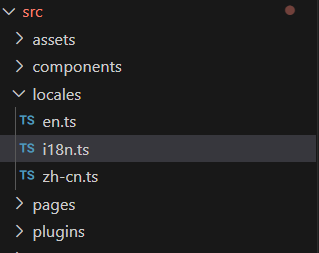

# vue3 项目中使用 i18n 国际化

[[toc]]

## 1. 安装 vue-i18n

```js
npm install vue-i18n
```

## 2. 创建 i18n 文件夹

创建一下文件，并进行相关配置。



1，在 src 目录下，新建 locales 文件夹

2，在 locales 文件夹中，新建 en.ts 、zh-cn.ts、i18n.ts 文件

**en.ts**：英文内容

```js
export default {
  button: {
    confirm: "Confirm",
    login: "Login"
  }
};
```

**zh-cn.ts**：中文内容

```js
export default {
  button: {
    confirm: "确认",
    login: "登录"
  }
};
```

**i18n.ts**： i18n 的相关配置内容

```js
// i18n配置
import { createI18n } from "vue-i18n";
import zhCn from "./zh-cn";
import en from "./en";

// 创建i18n
const i18n = createI18n({
  locale: localStorage.getItem("language") || "zhCn", // 语言标识
  globalInjection: true, // 全局注入,可以直接使用$t
  // 处理报错: Uncaught (in promise) SyntaxError: Not available in legacy mode (at message-compiler.esm-bundler.js:54:19)
  legacy： false,
  messages: {
    zhCn,
    en
  }
})

export default i18n;

```

## 3. 在main.ts中全局引入

```js
import i18n from './locales/i18n'; // i18n的配置文件路径，也就是 createI18n 的文件地址
createApp(App).use(i18n).mount('#app')
```

## 4. 使用

1, 在 `<template>`中可以直接使用`$t`

```js
<template>
	<div>
		<el-button type="primary" @click="toLogin">{{ $t('button.login') }}</el-button>
	</div>
</template>

```

2, 在js中使用

```js
import { useI18n} from 'vue-i18n';

const { t } = useI18n();
function login () {
  alert(t('button.login'));
}

```
## 5. 报错 legacy 属性

在vite脚手架项目当中，使用vue-i18n插件进行国际化多语言时，报错；

::: warning 报错
Uncaught SyntaxError: Not available in legacy mode
:::

### 5.1 问题分析

当前的vue-i18n 版本为

```js
“vue-i18n”: “^9.8.0”,
```

vue-i18n的8.x版本支持vue2.x和vue3.x

vue-i18n的9.x版本主要支持vue3.x

vue3中允许使用 Options API （legacy mode）和 Composition API 模式

但是vue-i18n的9.x版主不允许混合使用这两种模式，所以需根据vue3采用的模式来确定vue-i18n使用的模式

### 5.2 解决方案

**1.回退vue-i18n的版本（不推荐）**

**2.指定vue-i18n的使用模式**
在i18n的配置文件中，设置vue-i18n为Composition API 模式

```js
allowComposition: true,
```

```js
const i18n = createI18n({
  locale: localStorage.getItem("language") || "zhCn", // 语言标识
  globalInjection: true, // 全局注入,可以直接使用$t
  allowComposition: true,
  messages: {
    zhCn,
    en
  }
})
```

 
**3.设置legacy: false**

```js
const i18n = createI18n({
  locale: localStorage.getItem("language") || "zhCn", // 语言标识
  legacy: false,
  messages: {
    zhCn,
    en
  }
})
```
