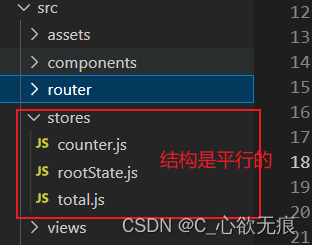
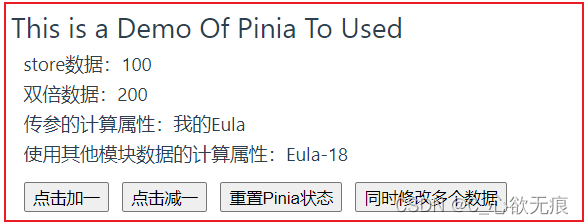

# Pinia 状态管理使用

[[toc]]

## 1，什么是 Pinia？

pinia 是由 vue 团队开发的，适用于 vue2 和 vue3 的状态管理库，
`它允许您跨组件/页面共享状态`；
主要侧重于 vue3 的组合式 API，当然 Vue2 也是可以使用的，本篇将介绍的是 vue3 使用；

::: tip 与 Vuex 比较

1. Pinia 不需要额外的 Map 辅助函数；(setup 和组合式 Api 的使用 Pinia 更容易，因此不需要 map helpers 功能)；
2. Pinia 相比 vuex 的模块少了 Mutaions 和 Modules;只保留了(State、Getters、Actions 以及新增了 Plugins)
3. Pinia 是平面结构，没有嵌套，可以任意交叉组合(使用其他模块的状态)；

:::

**为什么使用 Pinia?**

- dev-tools 支持([安装和使用链接](https://blog.csdn.net/liuxin00020/article/details/98873557))
- 热更新（在不重新加载页面的情况下修改 Store）
- 可以使用插件扩展 Pinia 功能
- 为 JS 用户提供适当的 TypeScript 支持或自动填充
- 服务器端渲染支持

## 2，安装 Pinia

```javascript
yarn add pinia
# 或者使用 npm
npm install pinia
```

## 3 ，Pinia 的引入

一般我们在做项目的时候，都会在 main.js 或者 main.ts 中引入。
vue3 main.js 中引入

```javascript
import { createPinia } from "pinia";
app.use(createPinia());

app.mount("#app");
```

## 4，Pinia 的结构

上面也说到 : Pinia 移除了 Mutations 和 modules 模块；只有`State、Getters、Actions`；

Pinia 是平面结构，没有嵌套，可以任意交叉组合 即可以使用其他模块的状态。



### 4.1、State

（1）默认情况下，通过 store 实例访问 state，可以直接读取和写入，store.count++。

（2）通过 store.$reset() 方法可以将 state 重置为初始值。

（3）除了直接通过 store 修改 state，还可以通过 store.$patch() 内置方法提交多个更改。

（4）可以通过 store.$subscribe() 订阅 State 的变化，在 patches 修改之后订阅只会触发一次。

### 4.2、Getters

（1）Getters 属性的值是一个函数，接受 state 作为第一个参数，目的是鼓励使用箭头函数。

（2）非箭头函数会可以通过 this 来访问 store 实例或 state，this.state.

### 4.3、Actions

（1）与 Gettes 一样可以通过 this 访问整个 store 实例。

（2）Actions 可以是异步的或同步的，不管怎样，都会返回一个 Promise。

（3）Actions 可以自由的设置参数和返回的内容，一切将自动推断，不需要定义 TS 类型。

（4）与 State 一样，可以通过 store.$onAction() 订阅 Actions，回调将在执行前触发，并可以通过参数 after() 和 onError() 允许在 Action 决议后和拒绝后执行函数。同样的，订阅绑定的是当前组件。

## 5，Pinia 的使用

下图是 Demo 演示的例子：

大家可以拷贝下来自己运行一下，注释都写的很清楚：



stores/counter.js （pinia 仓库的总体结构-简洁大方）

```javascript
import { ref, computed } from "vue";
import { defineStore } from "pinia";
// 可以引入其他模块并使用
import { rootSore } from "@/stores/rootState";

// Store 是使用 defineStore() 定义的，并且它需要一个唯一名称，作为第一个参数传递："myStore""
export const useStore = defineStore("myStore", {
  /* =================================State================================ */
  state: () => {
    // state 推荐用箭头函数的方式 利于类型推断
    return {
      counter: 100,
      name: "Eula", //尤菈
      isAdmin: true,
      items: [],
    };
  },

  /* =================================Getters================================ */
  getters: {
    /* 1,第一种使用 参数的方式访问 state */
    doubleCount: (state) => {
      return state.counter * 2;
    },
    /* 2,第二种使用 常规函数用this访问整个store的实例，不能使用箭头函数 因为箭头函数绑定的是外部this */
    trebleCount() {
      return this.counter * 3;
    },

    /* 3,需要将参数传递给getter 因为getter是计算属性 只能返回一个函数以接收任何参数*/
    receiveParams: (state) => {
      // params 是你调用的时候传进来的值
      return (params) => {
        return String(params) + state.name; // 我的优菈
      };
    },

    /* 4,可以访问其他store模块的 state 上面先引用 再使用*/
    useOtherStateOfModules: (state) => {
      // 实例化其他模块
      const otherStore = rootSore();
      return state.name + "-" + otherStore.age;
    },
  },

  /* =================================Actions================================ */
  actions: {
    //  这里使用常规函数 可以通过this进行访问store实例
    /* 自减函数 */
    induce() {
      this.counter--;
    },
    /* 随机数*/
    randomizeCounter() {
      this.counter = Math.round(100 * Math.random());
    },
  },
});
```

PiniaDemo.vue / 组价中使用(setup 语法糖)

```vue
<template>
  <div class="demo">
    <h2>This is a Demo Of Pinia To Used</h2>

    <p class="store">store数据：{{ store.counter }}</p>

    <!--下面了使用了pinia里面的计算属性 -->
    <p class="store">双倍数据：{{ store.doubleCount }}</p>
    <!-- 下面是传参的 getter -->
    <p class="store">传参的计算属性：{{ store.receiveParams("我的") }}</p>
    <!-- 下面是使用了其他模块数据的 getter -->
    <p class="store">
      使用其他模块数据的计算属性：{{ store.useOtherStateOfModules }}
    </p>

    <div class="btnContent">
      <button class="btn" @click="add">点击加一</button>
      <button class="btn" @click="reduce">点击减一</button>
      <button class="btn" @click="reset">重置Pinia状态</button>
      <button class="btn" @click="patch">同时修改多个数据</button>
    </div>
  </div>
</template>

<script setup>
import { reactive, ref, createApp, onMounted } from "vue";
/*  为了从 Store 中提取属性同时保持其响应式，您需要使用storeToRefs()。 它将为任何响应式属性创建 refs。 */
import { storeToRefs } from "pinia";

/* 1，引入对应的store模块 */
import { useStore } from "@/stores/counter";
/* 2，实例化 */
let store = useStore();
/* 3，使用 直接改变状态 */
const add = () => {
  // 此处可以直接通过赋值语句改变 state的值；不需要向vuex那样调用actions
  store.name = "Wendi";
  store.counter++;
  console.log("name：", store.name); //改动成功
};

/* 4，通过acions改变状态 */
const reduce = () => {
  // 每次点击 就减一
  store.induce();
  // console.log(store.induce);
  console.log("counter:", store.counter);
};

/* 点击重置状态
如果想要将数据重置到最开始更新数据的时候，pinia提供了一个方法：$reset()
*/
const reset = () => {
  store.$reset(); // 重置成功
};

/* 6，使用内置的 $patch 同时修改多个属性 */
const patch = () => {
  // 第一种 直接修改
  store.$patch({
    counter: store.counter + 1,
    name: "Abalam",
  });

  // 第二种 再回调函数中修改  可以拿到state 推荐使用这种
  store.$patch((state) => {
    state.items.push({ name: "shoes", quantity: 1 }); // push属性
    state.hasChanged = true;
  });
};

/* 7,订阅状态 使用 $subscribe 内置方法可以监听到状态的变化 */
store.$subscribe(
  () => {
    console.log("subscribe监听到了数据改变");
  },
  { detached: true }
);
</script>

<style scoped>
.btnContent {
  margin-top: 10px;
}
.btn {
  margin-left: 10px;
}
.store {
  margin-left: 10px;
}
</style>


```

stores/rootState.js (这是另一个模块，在 counter.js 模块会用到的)

```javascript
import { defineStore } from "pinia";
/* 这里是rootState的仓库 */
export const rootSore = defineStore("rootId", {
  state: () => {
    return {
      age: 18,
    };
  },
});
```

## 6，总结

Pinia 相对于 vuex 来说，确实减少的代码量，尤其删除了 Mutations 模块，在 Pinia 可以直接对状态进行修改；优化了原先多层嵌套的模块化，使每个模块都能任意访问，交叉组合；
