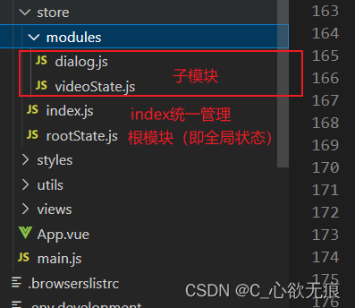

# vuex 详细讲解和 modules 模块化的使用

[[toc]]

## 1、vuex 简介

::: tip Vuex 介绍

Vuex 是一个专为 Vue.js 应用程序开发的状态管理模式。它采用集中式存储管理应用的所有组件的状态，并以相应的规则保证状态以一种可预测的方式发生变化。

:::

通俗的来说，vuex 是用于当某一状态需要在多个组件中共享，方便我们使用并追踪这些状态时使用。

## 2、vuex 总体结构

`vuex` 的总体结构分为 `modules` 下面的所有子模块和根模块（即全局状态） 这里我把 `rootState` 这个根模块放到了 `modules` 文件夹的外面，当然也可以放到里面；最后就是在 `index` 统一进行整合。



## 3、各子模块的内部结构及作用

这是 vuex 的内部代码结构，所有的子模块都是一样的；

`state`:存放数据状态；  
`action`:指派 `mutation` ；  
`mutation`:修改 state 里面的状态；  
`getter`:侧重于对数据的再次加工；  
`mdules`:用于模块化；

::: tip 温馨提示

我们更倾向于把异步请求放到 action 里面，当然 vuex 官方也有意这么做；一是为了追踪状态，二是为了做代码隔离，通常不受控的代码集中到 action；受控的操作放到 mutation 中，mutation 只做纯函数的状态改变；

:::

dialog.js

```javascript
/**
 * 弹窗组件模块 属于子模块
 */
const state = {
  dialog: "我是dialog"
};

const actions = {
  // 把 commit属性从 context里面解构出来
  setDialog: ({ commit }, dia) => commit("commitDialog", dia)
};

// 使用 mutation更新 state
const mutations = {
  commitDialog: (state, dialog) => (state.dialog = dialog)
};

// 把数据导出时可以对数据做一些操作 但不会改变原数据
const getters = {
  currentDialog: (state) => state.dialog + "123"
};

export default {
  state,
  mutations,
  actions,
  getters,
  namespaced: true
};
// namespaced: true  命名空间这一行一定要写，这是vuex寻找子组件的依据；
```

::: warning

注意这个设计和组件传值一样，是一个单向的数据流：是为了方便管理各个状态，知道状态在哪一步发生了改变，便于状态的维护和使用；

:::

## 4、index 文件的结构

上面是引入各个子模块的文件，下面在 modules 对象里面使用，要注意根模块一定要放在 modules 外面，因为他是特殊的，这边用扩展运算符直接把 roortState 解构进来了。

::: warning

注意这里面用到了持久化缓存插件 `vuex-persistedstate` 解决了 vuex 刷新页面状态丢失的问题，通过这个插件把 vuex 里面的数据都储存到了 localStorage 里面；

当然你也可以放到 `sessionStorage` 里面；只不过要这样写：

```javascript
plugins: [createPersistedState({ storage: window.sessionStorage })];
```

:::

index.js

```javascript
import Vue from "vue";
import Vuex from "vuex";
// 持久化缓存
import createPersistedState from "vuex-persistedstate";
// 下面引入子模块
import rootState from "./rootState"; // 根模块状态管理引入
import dialog from "./modules/dialog";
import videoState from "./modules/videoState";

Vue.use(Vuex);

export default new Vuex.Store({
  ...rootState, // 这里存放的是根模块 也就是全局模块
  modules: {
    dialog,
    videoState
  },
  // 把vuex里面的所有数据都储存到了localStorage里面 不用担心刷新数据丢失的问题
  plugins: [createPersistedState()]
});
```

## 5、开始使用

这是对以下代码的使用说明，主要配合了 vuex 辅助函数来进行使用；

::: info 下方代码说明

**1，getDialog()** 方法使用子模块 dialog 里面的 setDialog 方法改变了子模块的状态；

**2，getDialogGetter()** 方法使用子模块 dialog 里面的 Getter 属性获取了改变之后的数据； Getter 用于对 Store 中的数据进行加工，处理形成新的数据，不会修改 Store 中的原数据，类似计算属性。但 Store 中数据发生变化，Getter 的数据也会跟着变化；

**3，getRootState()** 方法使用根组件的 setRootStatue 方法改变了全局状态，注意：获取根组件的方法时 后面要加上 `{root:true}` 来标明这是根组件；可以参考我下面的写法；

**4，getRootState2()** 方法可以直接获取根组件里面的状态；这里在业务逻辑上可以做一些判断什么的

:::

页面中使用：

```javascript
<template>
  <!-- 父组件 -->
  <div class="dialog">
    <button @click="getDialog">使用子组件dialog里面的方法改变状态</button>
    <br />
    <button class="_getter" @click="getDialogGetter">获取弹窗组件getter返回的数据</button>
    <br>
    <button class="_getter" @click="getRootState">使用根模块里面的方法</button>
    <br>
    <button class="_getter" @click="getRootState2">获取根模块里面的数据</button>
  </div>
</template>

<script>
// 1.引入辅助函数
import { mapActions, mapGetters, mapMutations, mapState } from 'vuex';
export default {
  name: '',
  mixins: [],
  components: {
  },
  props: {},
  data() {
    return {
    };
  },
  computed: {
    // mapState 和 mapGetters
    ...mapState('dialog', ['dialog']),

    // 这里想要访问根模块里面的方法  需要这样写后面加上 {root:true}
    ...mapState(['rootStatue',{root:true}]),
    ...mapGetters('dialog', ['currentDialog']),

  },
  watch: {},
  created() {},
  mounted() {},
  methods: {
    // 2，使用
    ...mapActions('dialog', ['setDialog']),

    // 这里想要访问根模块里面的方法  需要这样写后面加上 {root:true}
    ...mapActions(['setRootStatue',{root:true}]),

	// 使用子组件dialog里面的方法改变状态
    getDialog() {
      console.log('之前的数据：', this.dialog);
      // 3，改状态
      this.setDialog('nihao');
      //4，查看是否改动成功  改动成功
      console.log('之后的数据：', this.dialog);
    },

    // 获取getter里面的内容
    getDialogGetter() {
      let dialogGetter = this.currentDialog;
      console.log('获取getter里面返回的数据：', dialogGetter);
    },

    // 使用根模块里面的方法改变状态
    getRootState(){
      console.log('之前的数据：', this.rootStatue);
      this.setRootStatue('false')
      console.log('改变后的数据：', this.rootStatue);
    },

    // 获取根模块里面的数据
    getRootState2(){
      console.log("根模块的数据：",this.rootStatue);
    },

  },
};
</script>

<style scoped lang="scss">
.tipsDialog {
  cursor: pointer;
}
._getter {
  display: block;
  margin-top: 10px;
}
</style>

```

rootState 根组件里面的结构

```javascript
/**
 * 根模块 储存全局状态管理
 */
const state = {
  rootStatue: "true"
};
// 使用 mutation更新 state
const mutations = {
  commitRootStatue: (state, sta) => (state.rootStatue = sta)
};
const actions = {
  setRootStatue: ({ commit }, sta) => commit("commitRootStatue", sta)
};

const getters = {};

export default {
  state,
  mutations,
  actions,
  getters,
  namespaced: true
};
```

## 6、总结

vuex 中一共有五个状态 `State Getter Mutation Action Module` ；需要知道他们的关系和侧重点；

::: tip 侧重点

- Action: 侧重请求数据以及对业务逻辑的判断处理等；
- Mutation: 侧重于对 state 里面的状态的修改；
- Getter : 侧重于对数据的再次加工和处理，如果你对数据的修改或使用却不想改变原数据；那么你可以使用它；
- Modules : 侧重于对多个状态的管理和分享；

:::
