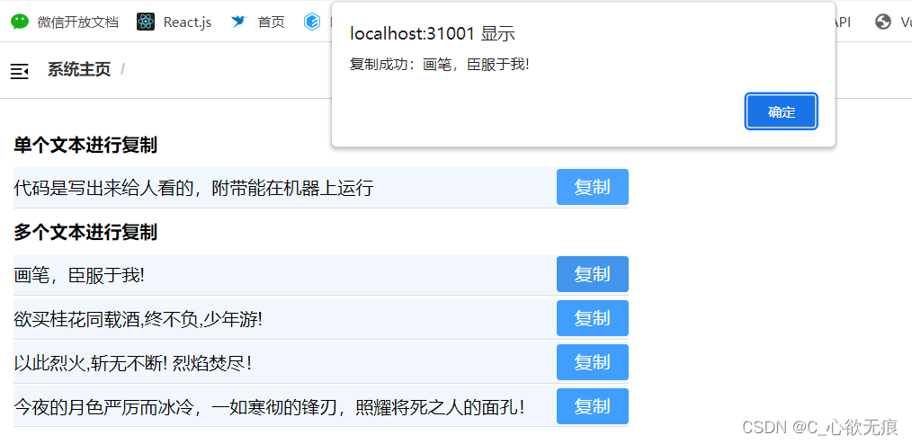

# vue使用clipboardjs 插件 一键复制文本

___
vue使用clipboardjs 插件 一键复制文本；[官方链接](https://clipboardjs.com/)


::: tip 效果图如下
1,这是比较常见的使用方式，左边一行文字，右边一个复制按钮，点击提醒用户复制成功；

2,可以进行简单的单行文本复制，也可以同时循环多行文本逐一进行复制



:::


## 1，clipboardjs 插件的优势

> 使用	`clipboardjs`复制文字到剪切板不需要配置几十个步骤或者加载几百 KB 的文件。最重要的是，它也不依赖 Flash或其他臃肿的框架。gzip 压缩后仅 3kb；
> 

## 2，npm安装

```javascript
npm install clipboard --save
```
## 3，在组件中引入(也可以挂载到vue的原型上面)

```javascript
//引入
import Clipboard from 'clipboard';
```
## 4，主要实现如下

需要注意的地方：

1，复制按钮上的 `data-clipboard-action='copy'` 属性说明是复制操作，如果是 cut说明是 剪贴操作；

2，复制按钮上的 `data-clipboard-target="#foo1"` 属性要和p标签上面拿的id值项对应，这样才能获取到p标签的文本内容；循环多个的时候需要注意一下；

3，复制按钮上的 `copyFun`点击事件里面 `new Clipboard('#btn')` 实例化操作的元素id要和 button按钮上的一致；

```javascript
<template>
  <div class="copy">
    <h4>单个文本进行复制</h4>
    <!-- 简单用法 -->
    <div class="one">
      <p id="foo1">{{ copyText }}</p>
      <!--复制按钮 -->
      <el-button id="btn" size="mini" type="primary" data-clipboard-action="copy" data-clipboard-target="#foo1" @click="copyFun">复制</el-button>
    </div>
    <!-- 高阶用法 -->
    <h4>多个文本进行复制</h4>
    <div class="list">
      <div class="item" v-for="(item, index) in copyTextList" :key="index">
        <p :id="item.textId">{{ item.text }}</p>
        <!--复制按钮 -->
        <el-button id="btn" type="primary" size="mini" data-clipboard-action="copy" :data-clipboard-target="'#' + item.textId" @click="copyFun">复制</el-button>
      </div>
    </div>
  </div>
</template>

<script>
//引入
import Clipboard from 'clipboard';
export default {
  name: 'copy',
  data() {
    return {
      // 单行文本的复制
      copyText: '代码是写出来给人看的，附带能在机器上运行',

      // 多行文本进行复制
      copyTextList: [
        {
          textId: 'p1',
          text: '画笔，臣服于我!',
        },
        {
          textId: 'p2',
          text: '欲买桂花同载酒,终不负,少年游!',
        },
        {
          textId: 'p3',
          text: '以此烈火,斩无不断! 烈焰焚尽！',
        },
        {
          textId: 'p4',
          text: '今夜的月色严厉而冰冷，一如寒彻的锋刃，照耀将死之人的面孔！',
        },
      ],
    };
  },
  methods: {
    /* 复制方法 */
    copyFun() {
      let clipboard = new Clipboard('#btn'); // 获取点击按钮的元素
      /* 注意此事件监听是异步的   */
      clipboard.on('success', (e) => {
        console.info('Text:', e.text);
        e.clearSelection();
        // 释放内存
        clipboard.destroy();
        return alert('复制成功：' + e.text);
      });
      // 复制失败
      clipboard.on('error', (e) => {
        console.error('Action:', e.action);
        console.error('Trigger:', e.trigger);
        // 释放内存
        clipboard.destroy();
        alert('该浏览器不支持自动复制');
      });
    },
  },
};
</script>

<style scoped lang="scss">
h4 {
  margin: 10px 0;
}
.one {
  max-width: 60%;
  display: flex;
  justify-content: space-between;
  align-items: center;
  border-bottom: 1px solid #dcdfe6;
  padding: 2px 0;
  background: #f1f7fd;
  #fo1 {
    margin-right: 10px;
  }
}

.list {
  max-width: 60%;
  .item {
    width: 100%;
    display: flex;
    justify-content: space-between;
    align-items: center;
    margin: 2px 0;
    border-bottom: 1px solid #dcdfe6;
    padding: 2px 0;
    background: #f1f7fd;
  }
}
</style>

```
**5，clipboardjs的兼容性如下（还是不错的）**
****

