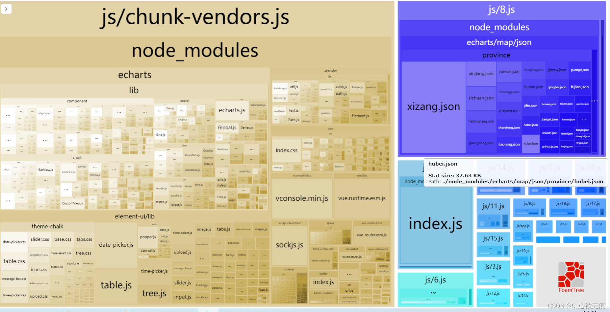
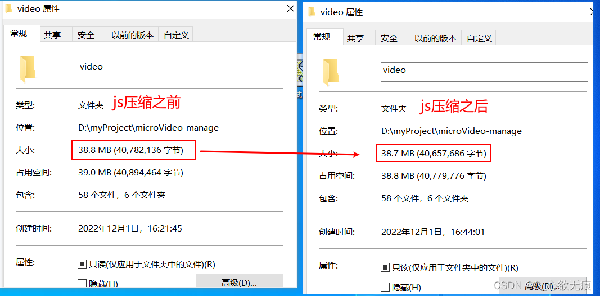

# 使用webpack-bundle-analyzer对打包进行可视化数据分析

> vue使用webpack-bundle-analyzer插件可以明确的看出每个文件模块的大小；常用来分析打包文件，优化代码等操作；

安装使用之后的效果如下：启动或打包项目，自动会在浏览器打开这个页面;


::: tip 可以看出
右上角最蓝色的部分占用的空间也是比较大的，因为用到了echarts的各省的地图数据；

除了图片右下角“FoamTree”> logo之外都是应用的代码，与此同时，所有用了node_modules资源的部分都以"\_vendor.js" 结尾;
:::

 



**1，安装**

```javascript
npm i webpack-bundle-analyzer -D
```
**2，使用**
修改`vue.config.js`文件,在`configureWebpack`配置模块中添加 ：config.plugins.push(new BundleAnalyzerPlugin());

```javascript
/* 先引入打包分析插件 */
const BundleAnalyzerPlugin = require('webpack-bundle-analyzer').BundleAnalyzerPlugin;

// 开始配置
module.exports = {
 /* webpack相关配置   *该对象将会被 webpack-merge 合并入最终的 webpack 配置   */
  configureWebpack: (config) => {
    config.plugins.push(new BundleAnalyzerPlugin());
 }
}
```
配置完成之后，启动或打包项目，自动会在浏览器打开这个页面；

## 扩展： 压缩插件uglifyjs-webpack-plugin使用

::: tip 
配置js和图片的压缩插件-看是否真正的压缩了打包大小
:::


### 1，先配置js的压缩配置，然后在进行打包，对比正常打包的大小，配置如下：

先安装：`uglifyjs-webpack-plugin`

```javascript
npm i uglifyjs-webpack-plugin -D
```

```javascript
 configureWebpack: (config) => {
    config.plugins.push(new BundleAnalyzerPlugin());
    /* js 压缩 */
     config.plugins.push(new UglifyJsPlugin({
      uglifyOptions: {
        uglifyOptions: {
          compress: {
            drop_debugger: true,
            drop_console: true // 生产环境自动删除console
          },
          warnings: false
        },
        sourceMap: false,
        parallel: true // 使用多进程并行运行来提高构建速度。默认并发运行数：os.cpus().length - 1。
      }
    }))
  },
```
**打包对比如下：可以看出使用js压缩代码 打包只减小了0.1MB的大小 可能项目比较小，没有发挥出完整的性能**




### 2，再配置图片的压缩配置，然后在进行打包，对比正常打包的大小，配置如下：
先安装：`image-webpack-loader` 注意：这个配置一定要cnpm下载 否则会出现问题

```javascript
cnpm install --save-dev image-webpack-loader
```
配置如下：

```javascript
/* 对内部的 webpack 配置（比如修改、增加Loader选项）(链式操作) */
  chainWebpack: (config) => {
   // 压缩图片插件
    config.module
      .rule('images')
      /* 注意会报这个错误 Cannot find module 'imagemin-gifsicle' 需要下载cnpm install --save-dev image-webpack-loader 才有效*/
      .use('image-webpack-loader')
      .loader('image-webpack-loader')
      .options({
        mozjpeg: { progressive: true, quality: 65 },
        optipng: { enabled: false },
        pngquant: { quality: [0.8, 0.9], speed: 4 },
        gifsicle: { interlaced: false },
        webp: { quality: 75 },
      });
  },
```
**打包对比如下：可以看出使用图片压缩插件代码 打包大小减小了0.7MB**


大家也可以对比一下使用压缩之后的打包大小；
