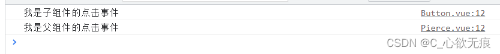

# Attributes 属性透传

[[toc]] 

::: tip 

透传attribute指的是传递给一个组件，却没有被该组件声明为 props 或 emits 的 attribute 或者 v-on 事件监听器。最常见的例子就是 class、style 和 id。

当一个组件以单个元素为根作渲染时，透传的 attribute 会自动被添加到**根元素上**。

(**注意**：会自动添加到根元素上面) 

:::

## 1，属性的继承（Attributes）

1，假如我们有一个子组件（Button），它的模板长这样：

```javascript
<template>
  <div>
    <button>我是一个按钮</button>
    <span>Fallthrough attribute: {{ $attrs }}</span>
  </div>
</template>
```

2，一个父组件（Pierce）使用了这个组件，并且传入了 class 类名 btn：

```javascript
<template>
  <div class="pierce">
    <h3>组件属性透穿的演示:</h3>
    <Button class="btn" @click="onClick"></Button>
  </div>
</template>

```

3，最后渲染出的 DOM 结果是：

```javascript
<button class="btn">我是一个按钮</button>
```

4，可以看出类名 btn 自动透传到子组件的根元素上。如果我们在外面包裹了一层 div ,我们可以在模板通过 `$attrs` 拿到传递的属性或 在节点上使用 `v-bind="$attrs"`进行使用；如下：

```javascript
<div class="aaa">
  <button class="btn" v-bind="$attrs">
    我是父组件穿透过来的属性 {{ $attrs }}
  </button>
</div>
```

## 2，对 class 和 style 的合并

如果一个子组件的根元素已经有了同名的 class 或 style ，它会和从父组件上继承的值进行合并。

```javascript
<button class="btn large">我是一个按钮</button>
```

## 3，同样点击事件也能进行透穿

1，子组件（Button）子组件上面有一个点击事件 onClick

```vue
<script setup>
import { reactive, ref, createApp } from "vue";
const onClick = () => {
  console.log("我是子组件的点击事件");
};
</script>

<template>
  <button @click="onClick" class="btn">我是一个按钮</button>
</template>
```

2，父组件

父组件也有一个同名的点击事件 onClick

```vue
<script setup>
import { reactive, ref, createApp } from "vue";
const onClick = () => {
  console.log("我是父组件的点击事件");
};
</script>

<template>
  <div class="pierce">
    <h3>组件属性透穿的演示:</h3>
    <Button class="btn" @click="onClick"></Button>
  </div>
</template>
```

3，最终这两个点击事件都能触发点击按钮 控制台打印如下：



## 4，禁用 Attributes 继承

如果你不想要一个组件自动地继承 attribute，你可以在**子组件选项中**设置 inheritAttrs: false。

如果你使用了 `<script setup>`，你需要一个额外的 `<script></script`> 块来书写这个选项声明：

```vue
<script>
// 使用普通的 <script> 来声明选项 来禁用穿透
export default {
  inheritAttrs: false
};
</script>

<script setup>
// ...setup 部分逻辑
</script>
```
