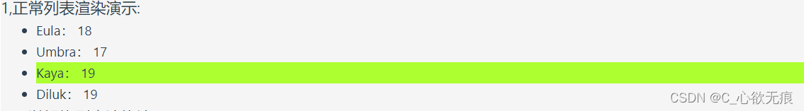
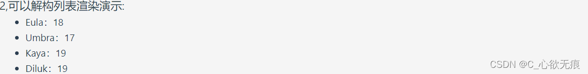
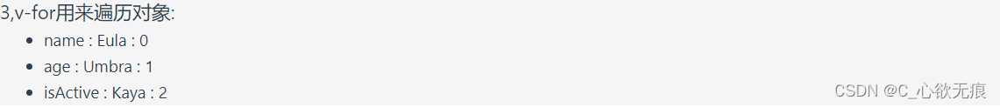

# 使用 v-for 进行列表渲染

vue3 中的列表渲染里面的对象属性在循环的过程中可以直接解构出来并使用的；

## 一、正常的列表渲染

1，`v-for` 指令基于一个数组来渲染一个列表。`v-for` 指令的值需要使用` item in items` 形式的特殊语法，其中` items` 是源数据的数组，而 `item` 是迭代项的别名。

2，在 `v-for`块中可以完整地访问父作用域内的属性和变量。`v-for` 也支持使用可选的第二个参数表示当前项的位置索引。

这个例子是在页面上渲染一些字段 ，当鼠标移入时改变选中项的背景颜色；

```javascript
<script setup>
import { reactive, ref, createApp, onMounted } from "vue";

let list1 = ref([
  { name: "Eula", age: "18", isActive: false },
  { name: "Umbra", age: "17", isActive: false },
  { name: "Kaya", age: "19", isActive: false },
  { name: "Diluk", age: "19", isActive: false },
]);
// 监听鼠标移入事件 选中的变绿
const mousemove = (item) => {
  list1.value.forEach((item2) => {
    item2.isActive = item.name == item2.name ? true : false;
  });
};
<script>
<template>
  <div class="list">
    <h3>1,正常列表渲染演示:</h3>
    <ul>
      <li
        v-for="item in list1"
        :key="item.name"
        :class="item.isActive ? 'active' : ''"
        @mousemove="mousemove(item)"
      >
        {{ item.name }}： {{ item.age }}
      </li>
    </ul>
  </div>
</template>

<style scoped>
.active {
  background-color: greenyellow;
}
.list{
  background-color: #f5f5f5;
}
</style>
```

**运行结果如下：**



## 二、解构的列表渲染

::: tip 注意

实际上，你也可以在定义 v-for 的变量别名时使用解构，和解构函数参数类似；

:::

```javascript
<script setup>
import { reactive, ref, createApp, onMounted } from "vue";
let list1 = ref([
  { name: "Eula", age: "18", isActive: false },
  { name: "Umbra", age: "17", isActive: false },
  { name: "Kaya", age: "19", isActive: false },
  { name: "Diluk", age: "19", isActive: false },
]);
// 深拷贝得来的list2已经失去的响应式 视图不会自动更新 后续不能操作数据 只能用于渲染静态视图
let list2 = JSON.parse(JSON.stringify(list1.value));

<template>
  <div class="list">
    <h3>2,可以解构列表渲染演示:</h3>
    <ul>
      <li v-for="({ name, age }, index) in list2" :key="index || age">
        {{ name }}：{{ age }}
      </li>
    </ul>
  </div>
</template>
</script>
```

**运行结果如下：**



## 三、v-for 用来遍历对象

::: tip 注意

也可以使用 v-for 来遍历一个对象的所有属性。遍历的顺序会基于对该对象调用 [Object.keys()](https://developer.mozilla.org/zh-TW/docs/Web/JavaScript/Reference/Global_Objects/Object/keys) 的返回值来决定。  
第一个参数是属性值  
第二个参数表示属性名  
第三个参数表示索引值

:::

**注意：当只写一个参数的时候，默认是属性值**

```javascript
<script setup>
import { reactive, ref, createApp, onMounted } from "vue";
let list3 = ref({
  name: "Eula",
  age: "Umbra",
  isActive: "Kaya",
});
<template>
  <div class="list">
   <h3>3,v-for用来遍历对象:</h3>
    <ul>
      <li v-for="(value, key, index) in list3" :key="index">
        {{ key }} : {{ value }} : {{ index }}
      </li>
    </ul>
  </div>
</template>
</script>
```

**运行结果如下：**


