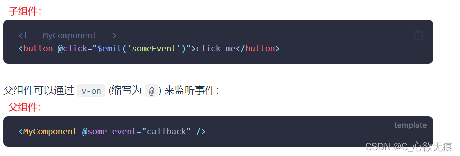

# 组件注册和组件通信

这里介绍的是 vue3 中组件的注册和组件通信父传子，子传父。

前提：用的是 vue3 版本且使用了 setup 语法糖 `<script setup> .....<script>`

## 1，组件注册

**1.1，全局注册：**

> 全局注册需要在 在 main.js 中进行注册；
> 全局注册的组件可以在此应用的任意组件的模板中使用；

```javascript
import { createApp } from "vue";
这是两个组件;
import InputList from "@/components/component/Input.vue";
import Footer from "@/components/component/Footer.vue";

const app = createApp(App);
可以进行链式注册;
app.component("InputList", InputList).component("Footer", Footer);
```

**1.2，局部注册**

```javascript
<script setup>
import { reactive, ref, createApp } from "vue";
/* 组件局部注册 */
const app = createApp({});
import InputList from "@/components/component/Input.vue";
app.component({
  InputList,
});
</script>
```

## 2，组件通信

### 2.1，父传子

> (1) 组件传值和 vue2 的原理是一样的，用自定义属性进行传值；
> 
> (2) 在使用 `<script setup>` 的单文件组件中，props 可以使用 defineProps() 宏来声明：

**父组件：**

```vue
<script setup>
import { reactive, ref, createApp } from "vue";
/* 父组件需要传给子组件的值 */
const inputList = ref([
  {
    name: "胡桃",
    age: 18,
    value: "112222222222",
  },
  {
    name: "行秋",
    age: 20,
    value: "1333333333333",
  },
  {
    name: "钟离",
    age: 5000,
    value: "14444444444444",
  },
]);
</script>

<template>
  <div class="demo">
    <h3>组件使用:</h3>
    <InputList foo="aaa" :phoneList="inputList" @submit="submit" />
  </div>
</template>
```

可以看到这里使用了 InputList 组件，传了一个字符串(aaa)和一个数组(inputList);

::: warning 注意
自定义属性如果前面不加冒号(:)会默认你传的是一个字符串，加上冒号才说明你在此处引用的是一个变量；
:::

**子组件：**

> (1) 子组件可以更细致地声明对传入的 props 的校验要求，是否必传，是否有默认值；
> 
> (2) 接收对象或数组的默认值 必须从一个工厂函数返回才可以使用；


**需要注意的是：**

1， 在子组件中，props 接收到的值是响应式的，是通过reactive方式构造的` isReactive(props) = true`；所以在组件中使用时不用添加`.value`;

2,  解构props需要使用toRefs或者toRef；否则丢失响应式。因为第一条它是由reactive方式构造的响应式数据。

```vue
<script setup>
/* 这种形式是针对 setup语法糖的写法
 * 允许接收多个属性
 */
const props = defineProps({
  // foo是我从父元素传进来的字符串
  foo: {
    type: String, //类型约定
    required: false, //是否必传
    default: "bbb", // 默认值 不传的时候触发 传空字符也不会触发
  },

  /* phoneList 是一个数组,对象或数组的默认值 必须从一个工厂函数返回。 */
  phoneList: {
    type: Array,
    required: true,
    // 父组件不传则会使用下面的值
    default(Props) {
      return [
        {
          name: "胡桃",
          age: 18,
          value: "112222222222",
        }
        ....
      ];
    },
  },
});
console.log("props:", props);
</script>
```

### 2.2，子传父

> 在子组件的模板中，可以直接使用 $emit 方法触发自定义事件进行传值；如图所示：



**子组件：**

```vue
<script setup>
import { reactive, ref } from "vue";

/* 我们在 <template> 中使用的 $emit 方法不能在组件的 <script setup> 部分中使用，但 defineEmits() 会返回一个相同作用的函数供我们使用： */
const emit = defineEmits(["submit"]);

/* 确认按钮  点击然后用自定义事件用来传给父组件一些有用的信息 */
const enter = () => {
  // 传给父组件 可以添加参数
  emit("submit",inputList.value);
}
</script>
<template>
  <div class="demo">
      <div class="submit"><button @click="enter">确 认</button></div>
    </div>
  </div>
</template>
```

**父组件：**

```javascript
<script setup>
import { reactive, ref, createApp } from "vue";
// 接收子组件传过来的参数
const submit = (params) => {
  console.log("params", params);
};
</script>

<template>
  <div class="demo">
    <h3>组件使用:</h3>
    <InputList foo="aaa" :phoneList="inputList" @submit="submit" />
  </div>
</template>
```

## 3，所有代码

这里是当前案例的所有代码,还不太懂的话可以在看一下；

父组件：

```javascript
<script setup>
import { reactive, ref, createApp } from "vue";
/* 组件局部注册 */
const app = createApp({});
import InputList from "@/components/component/Input.vue";
app.component({
  InputList,
});

/* 父组件需要传给子组件的值 */
const inputList = ref([
  {
    name: "胡桃",
    age: 18,
    value: "112222222222",
  },
  {
    name: "行秋",
    age: 20,
    value: "1333333333333",
  },
  {
    name: "钟离",
    age: 5000,
    value: "14444444444444",
  },
]);

// 接收子组件传过来的参数
const submit = (params) => {
  console.log("params", params);
};
</script>

<template>
  <div class="demo">
    <h3>组件使用:</h3>
    <InputList foo="aaa" :phoneList="inputList" @submit="submit" />
  </div>
</template>

<style></style>
```

子组件：

```javascript
<script setup>
import { reactive, ref } from "vue";
import "./Input.css";

/* 这种形式是针对 setup语法糖的写法
 * 允许接收多个属性
 */
const props = defineProps({
  // foo是我从父元素传进来的字符串
  foo: {
    type: String, //类型约定
    required: false, //是否必传
    default: "bbb", // 默认值 不传的时候触发 传空字符也不会触发
  },

  /* phoneList 是一个数组
    对象或数组的默认值
    必须从一个工厂函数返回。
    该函数接收组件所接收到的原始 prop 作为参数
    */
  phoneList: {
    type: Array,
    required: true,
    // 父组件不传则会使用下面的值
    default(Props) {
      return [
        {
          name: "胡桃",
          age: 18,
          value: "112222222222",
        },
        {
          name: "行秋",
          age: 20,
          value: "1333333333333",
        },
        {
          name: "钟离",
          age: 5000,
          value: "14444444444444",
        },
      ];
    },
  },
});
console.log("props:", props);

/* 这里对数据做一些拷贝 拷贝之后的数据也是响应式的 因为用的是ref */
const inputList = ref(props.phoneList);

/* 我们在 <template> 中使用的 $emit 方法不能在组件的 <script setup> 部分中使用，但 defineEmits() 会返回一个相同作用的函数供我们使用： */
const emit = defineEmits(["submit"]);

/* 添加按钮 */
const addInput = () => {
  let inputsList = inputList.value;
  if (inputsList.length >= 4) {
    alert("至多只能填写四个");
    return;
  }
  inputList.value.push({
    value: "",
  });
};

/* 删除按钮 */
const delInput = () => {
  let inputsList = inputList.value;
  if (inputsList.length <= 1) {
    alert("至少要填写一个");
    return;
  }
  inputsList.pop();
};

/* 确认按钮  用自定义事件用来传给父组件一些有用的信息 */
const enter = () => {
  const isHaveEmpty = inputList.value.find((item, index) => {
    return item.value === "";
  });
  if (isHaveEmpty) {
    return alert("输入框不能为空！");
  }

  // 传给父组件 可以添加参数
  emit("submit",inputList.value);

};
</script>

<template>
  <div class="demo">
    <p>This is a input 组件</p>
    <div class="input">
      <div class="-btn">
        <button class="btn" @click="addInput">点击添加</button>
        <button class="btn" @click="delInput">点击删除</button>
      </div>
      <div class="inpContainer">
        <input
          type="text"
          v-for="item in inputList"
          :key="item.name"
          v-model="item.value"
          class="inp"
        />
      </div>
      <div class="submit"><button @click="enter">确 认</button></div>
    </div>
  </div>
</template>
<style>
.input .-btn {
  width: 200px;
  display: flex;
  justify-content: flex-start;
  align-items: center;
  height: 30px;
}
.btn {
  cursor: pointer;
  margin-left: 10px;
}

.inpContainer {
  display: inline-block;
  width: 50%;
  height: auto;
  display: flex;
  justify-content: flex-start;
  align-items: center;
  flex-wrap: wrap;
}
.inp {
  width: 180px;
  height: 30px;
  margin: 5px 10px;
}
.submit{
  cursor: pointer;
  margin-left: 10px;
}
</style>


```
