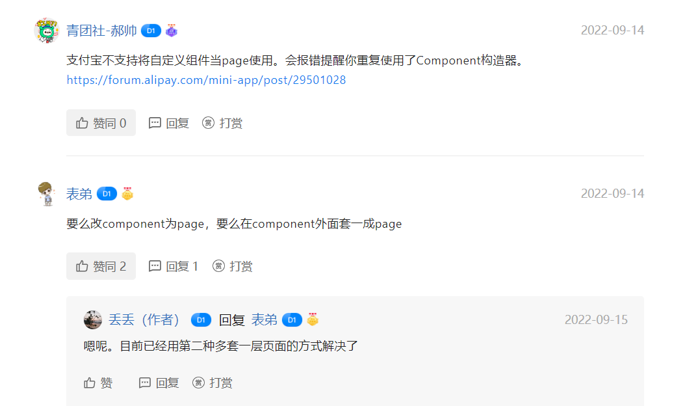

# 支付宝不支持将自定义组件当page使用

## 问题描述

支付宝小程序不支持将自定义组件当page使用。

::: warning
重复使用了Component构造器
:::

## 解决方案

1, 要么改component为page，

2, 要么在component外面套一成page

如下图所示：

社区回答链接：https://open.alipay.com/portal/forum/post/97201041