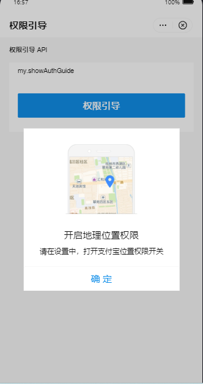
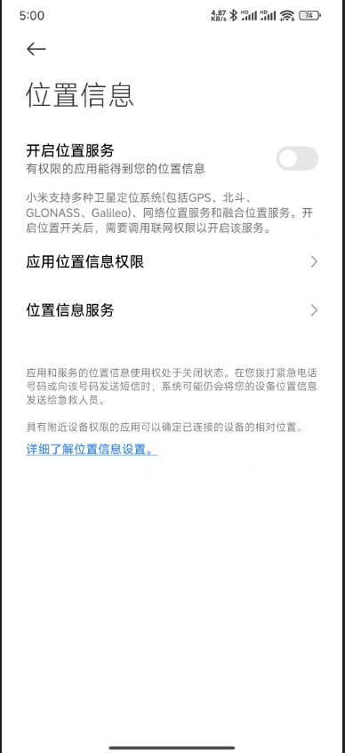

# 支付宝小程序引导用户开启定位

---

**需求**：小程序需要获取用户当前位置信息，并保存到数据库中。

如果用户不小心点到`拒绝授权`按钮，则引导用户打开`位置授权设置页面`。

## 实现如下

这段代码的含义是获取用户当前位置信息，如果授权成功则保存到变量中，否则引导用户打开位置设置页面。

`isAuthLocation`为`true`表示用户已经授权。

```js
<!-- 位置授权常驻btn -->
<view @click="getCurrentLocation" class="location-auth" v-if="!user_s.isAuthLocation">
    <view class="circle"> 位置授权 </view>
</view>

/**
 *  页面可见时要重新获取位置
 */
onShow(async () => {
  await getCurrentLocation(); //获取位置
});


/**
 *  授权和获取当前位置
 */
function getCurrentLocation() {
  // 1:获取经纬度和省市区县数据  2:具有街道数据
  my.getLocation({
    type: 2,
    success: (res) => {
      user_s.isAuthLocation = true; // 成功授权-需要保存授权数据
      const { longitude, latitude, province, city, district, streetNumber } = res;
      siteListParams.value.city = city;
      siteListParams.value.longitude = longitude;
      siteListParams.value.latitude = latitude;
      getPhysicalTestingPage(); // 重新请求数据
    },
    fail: (res) => {
      user_s.isAuthLocation = false;
      // 引导用户打开位置设置
      my.showAuthGuide({
        authType: "LBS",
        success: (res) => {
          // isOpenAuthDialog.value = true; - 暂时没有使用
        },
        fail: (error) => {}
      });
    }
  });
}
```

开启位置引导：



开启定位：




参考链接：https://opendocs.alipay.com/mini/api/show-auth-guide