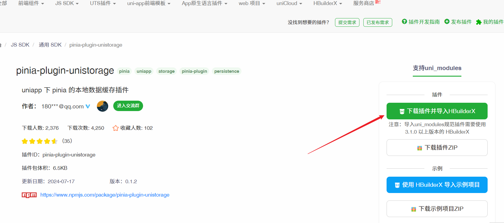

# uniApp 中使用 pinia 状态管理库与持久化

## 一、安装插件

如下图所示:



## 二、引入

main.js 中引入:

```js
// main.js
import { createSSRApp } from "vue";
import * as Pinia from "pinia";
import { createUnistorage } from "pinia-plugin-unistorage";

export function createApp() {
  const app = createSSRApp(App);

  const store = Pinia.createPinia();

  // 关键代码 👇
  store.use(createUnistorage());

  app.use(store);

  return {
    app,
    Pinia // 此处必须将 Pinia 返回
  };
}
```

## 三、初始化

根目录创建 store 文件夹，在该文件夹内添加 user.js 文件，内容如下：

```js
import { defineStore } from "pinia";

export const useStore = defineStore("user", {
  state() {
    return {
      state: "hello pinia",
      token: ""
    };
  },
  unistorage: true, // 开启后对 state 的数据读写都将持久化

  actions: {
    // 设置token信息
    setUserInfo(userInfo: UserModel) {
      this.userInfo = userInfo;
    },
    // 设置当前患者信息
    setCurrentPatientInfo(patientInfo: PatientModel) {
      this.currentPatientInfo = patientInfo;
    }
  },

  getters: {
    sex(state) {
      if (state.currentPatientInfo?.sex) {
        return state.currentPatientInfo?.sex === 1 ? "男" : "女";
      }
      return "-";
    },
    age(state) {
      if (state.currentPatientInfo?.birthday) {
        return calculateAge(state.currentPatientInfo?.birthday) ?? "-";
      }
      return "-";
    }
  }
});
```

## 四、页面使用

```js
<script setup lang="ts">
  import {useStore} from "@/store/user"; 
  const user = userStore();

  然后就可以取到user仓库里面的数据和方法了
  console.log(user.state);
</script>
```
