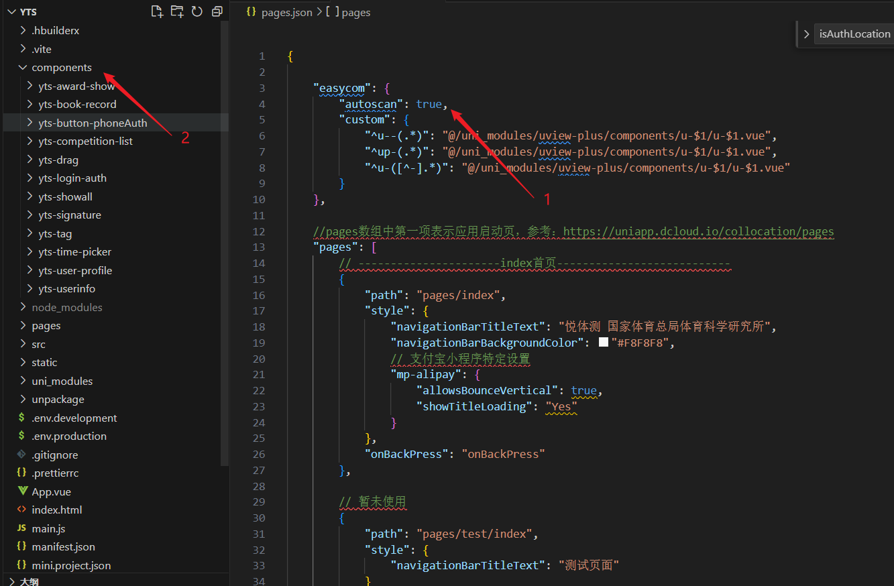

# 自动按需引入组件(easycom)

## 1.介绍

传统 vue 组件，需要安装、引用、注册，三个步骤后才能使用组件。easycom 将其精简为一步。

只要组件`路径符合规范`（具体见下），就可以不用引用、注册，直接在页面中使用。如下：

```js
<template>
	<view class="container">
		<comp-a></comp-a>
		<uni-list>
		</uni-list>
	</view>
</template>
<script>
	// 这里不用import引入，也不需要在components内注册uni-list组件。template里就可以直接用
	export default {
		data() {
			return {}
		}
	}
</script>

```

## 2.路径规范

**路径规范指：**

安装在项目根目录的components目录下，并符合components/组件名称/组件名称.vue
安装在uni_modules下，路径为uni_modules/插件ID/components/组件名称/组件名称.vue

工程目录：
```js
┌─components
│  └─comp-a
│    └─comp-a.vue      符合easycom规范的组件
└─uni_modules          [uni_module](/plugin/uni_modules.md)中符合easycom规范的组件
   └─uni_modules
     └─uni-list
       └─components
         └─uni-list
           └─ uni-list.vue
```

不管`components目录`下安装了多少组件，`easycom` 打包会自动剔除没有使用的组件，对组件库的使用尤为友好。

组件库批量安装，随意使用，自动按需打包。以官方的uni-ui为例，在HBuilderX新建项目界面选择uni-ui项目模板，只需在页面中敲u，拉出大量组件代码块，直接选择，即可使用。大幅提升开发效率，降低使用门槛。

在uni-app插件市场下载符合components/组件名称/组件名称.vue目录结构的组件，均可直接使用。


## 3.自定义规则
**自定义easycom配置的示例**

`easycom`是自动开启的，不需要手动开启，有需求时可以在`pages.json`的`easycom`节点进行个性化设置，如关闭自动扫描，或自定义扫描匹配组件的策略。设置参数如下：

|属性			|类型		|默认值	|描述																																											|
|:-				|:-			|:-			|:-																																												|
|autoscan	|Boolean|true		|是否开启自动扫描，开启后将会自动扫描符合`components/组件名称/组件名称.vue`目录结构的组件	|
|custom		|Object	|-			|以正则方式自定义组件匹配规则。如果`autoscan`不能满足需求，可以使用`custom`自定义匹配规则	|

如果你的组件，不符合easycom前述的`路径规范`。可以在pages.json的easycom节点中自行定义路径规范。

如果需要匹配node_modules内的vue文件，需要使用`packageName/path/to/vue-file-$1.vue`形式的匹配规则，其中`packageName`为安装的包名，`/path/to/vue-file-$1.vue`为vue文件在包内的路径。

```json
"easycom": {
  "autoscan": true,
  "custom": {
    "^uni-(.*)": "@/components/uni-$1.vue", // 匹配components目录内的vue文件
    "^vue-file-(.*)": "packageName/path/to/vue-file-$1.vue" // 匹配node_modules内的vue文件
  }
}
```

**说明**

1、 `easycom`方式引入的组件无需在页面内`import`，也不需要在`components`内声明，即可在任意页面使用。

2、 `easycom`方式引入组件不是全局引入，而是局部引入。例如在H5端只有加载相应页面才会加载使用的组件。

3、 在组件名完全一致的情况下，`easycom`引入的优先级低于手动引入（区分连字符形式与驼峰形式）。

4、 考虑到编译速度，直接在`pages.json`内修改`easycom`不会触发重新编译，需要改动页面内容触发。

5、`easycom`只处理vue组件，不处理小程序专用组件（如微信的wxml格式组件）。不处理后缀为.nvue的组件。因为nvue页面引入的组件也是.vue组件。可以参考uni ui，使用vue后缀，同时兼容nvue页面。

6、 `nvue`页面里引用`.vue`后缀的组件，会按照nvue方式使用原生渲染，其中不支持的css会被忽略掉。这种情况同样支持`easycom`。

7、 `vue` 与 `uvue` 组件优先级，[详见](https://doc.dcloud.net.cn/uni-app-x/component/#priority)。


## 4.项目使用

`autoscan:true` 开启自动扫描 开启后将会自动扫描符合components/组件名称/组件名称.vue目录结构的组件




然后页面中直接使用,无需引用。

```js
<yts-award-show></yts-award-show>
```
