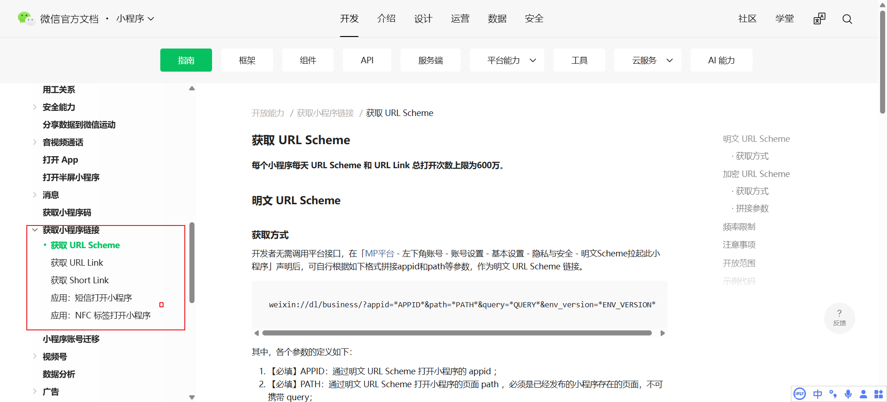

# 普通 H5 跳转微信 APP 完整梳理

> 能做什么、不能做什么，大厂怎么做的，一篇讲透普通 H5 与微信之间的跳转边界


## 一、前言

日常开发中经常被问起：**普通 H5 页面能不能直接跳到微信 APP？能跳到什么程度？淘宝、美团为什么能丝滑地跳到微信支付？**

这类问题之所以容易踩坑，是因为大多数人把"跳微信"当成一个需求，而它实际上是**一组需求**：拉起微信本尊、跳转小程序、唤起支付、分享、登录……每一项的技术路径、资质要求、稳定性都完全不同。

本文的思路是：**先判断环境，再谈方案**——因为普通 H5 跳微信的一切能力边界，都由"你的页面运行在哪里"和"你要跳到哪里"这两个变量决定。


## 二、方法论：两个变量决定一切

### 2.1 变量一：H5 运行在哪个环境？

| 环境 | 特征 | 能力边界 |
|------|------|----------|
| 微信内置浏览器 | UA 含 `MicroMessenger` | **Scheme 被禁用**，只能走开放标签 |
| 企业微信内置浏览器 | UA 额外含 `wxwork` | 不支持开放标签，需单独处理 |
| 外部浏览器（Safari / Chrome 等） | 普通浏览器 UA | 可用 URL Scheme，但受浏览器拦截策略影响 |
| APP 内 WebView | 宿主 APP 封装 | 取决于宿主是否放行 |

环境判断代码：

```js
const ua = navigator.userAgent;

export const isWeChat = /MicroMessenger/i.test(ua);        // 微信内置浏览器
export const isWxWork = /wxwork/i.test(ua);                // 企业微信
export const isAndroid = /android/i.test(ua);
export const isIOS = /iphone|ipad|ipod/i.test(ua);
```

### 2.2 变量二：要跳到哪里？

| 目标 | 可行性 | 依赖官方产品的程度 |
|------|--------|---------------------|
| 打开微信 APP 本身 | ✅ 简单 | 无 |
| 打开微信 + 指定小程序 | ✅ 可靠 | 官方 Scheme / URL Link |
| 微信内打开小程序 | ✅ 可靠 | 开放标签（认证服务号） |
| 拉起微信支付 | ⚠️ 有门槛 | 微信支付商户 + OpenSDK |
| 登录 / 分享到微信 | ⚠️ 有门槛 | 微信开放平台 + OpenSDK |
| 深层功能（扫一扫、朋友圈、指定聊天） | ❌ 基本不可行 | 历史路径已失效 |

先看清这两张表，后面的具体方案只是把格子填满。


## 三、外部浏览器：URL Scheme 直跳微信

### 3.1 基础用法

微信注册了 `weixin://` 私有协议，外部浏览器可以直接唤起：

```html
<a href="weixin://">打开微信</a>
```

```js
window.location.href = 'weixin://';

// 部分场景用隐藏 iframe 兼容性更好
// const iframe = document.createElement('iframe');
// iframe.style.display = 'none';
// iframe.src = 'weixin://';
// document.body.appendChild(iframe);
```

效果：已安装微信 → 通常打开微信主界面；未安装 → 页面无反应或弹"无法打开"。

### 3.2 关键限制

- **深层路径基本全灭**：早期公开的 `weixin://dl/scan`、`weixin://dl/moments`、`weixin://dl/chat` 等已被微信大幅限制或失效，**不要依赖它们做深度跳转**。
- **Chrome 安卓版拦截**：Scheme 跳转必须在**用户手势的同步调用链**里触发，放在异步回调（如接口返回后）会被当弹窗拦截。
- **微信内置浏览器完全禁用** `weixin://`，静默失败、无任何报错。
- **唤起结果没有回调**，只能靠经验判断。

### 3.3 唤起检测：怎么知道跳没跳成功？

业界通用做法是**页面可见性变化 + 超时兜底**：

```js
/**
 * 尝试通过 Scheme 唤起 APP
 * @returns {Promise<boolean>} 是否唤起成功
 */
export function tryLaunchApp(scheme) {
  return new Promise((resolve) => {
    let timer = null;

    const cleanup = () => {
      clearTimeout(timer);
      window.removeEventListener('visibilitychange', onVisibility);
      window.removeEventListener('pagehide', onVisibility);
    };

    // 页面不可见 ≈ 成功切到了 APP
    const onVisibility = () => {
      if (document.hidden || document.visibilityState === 'hidden') {
        cleanup();
        resolve(true);
      }
    };

    window.addEventListener('visibilitychange', onVisibility);
    window.addEventListener('pagehide', onVisibility);

    // 兜底：2.5s 内页面仍可见，视为唤起失败
    timer = setTimeout(() => {
      cleanup();
      resolve(false);
    }, 2500);

    window.location.href = scheme;
  });
}

const ok = await tryLaunchApp('weixin://');
if (!ok) showFallbackGuide(); // 见第六节降级方案
```

**原理**：Scheme 拉起成功时页面会立即切后台（`document.hidden` 变 `true`）；失败则页面纹丝不动，超时判定失败。iOS 上唤起瞬间 `setTimeout` 可能延迟触发导致误判，所以要同时监听 `pagehide`。


## 四、进阶目标：打开微信并进入指定小程序

如果目标不是"打开微信"，而是"打开微信 + 进某个小程序"，这是目前**最正规、最稳定**的官方路径，普通 H5（微信外）可以正式使用。



### 4.1 三种官方形式对比

| 形式 | 格式 / 产物 | 获取方式 | 特点 |
|------|-------------|----------|------|
| 加密 Scheme | `weixin://dl/business/?t=TICKET` | 服务端接口 `generateScheme` | 任意页面、可带参数，推荐生产使用 |
| 明文 Scheme | `weixin://dl/business/?appid=...&path=...` | 后台声明后自行拼接 | 无需接口，但页面需提前声明 |
| URL Link | `https://wxaurl.cn/xxx` | 服务端接口 `generateUrlLink` | https 链接，不被浏览器当"危险协议"拦截 |

### 4.2 加密 Scheme（推荐）

```js
location.href = 'weixin://dl/business/?t=你的TICKET';
```

- TICKET 由服务端调用 `generateScheme` 生成，适用于短信、邮件、外部网页等场景。
- 有效期生成时可配置（最长 30 天内），**不要长期写死在页面里**，应由后端实时生成。
- 配额：每天生成加密 Scheme + URL Link 合计上限 **50 万**，每天打开总次数上限 **600 万**。
- 打开小程序的场景值固定为 **1065**，可用于来源统计。

### 4.3 明文 Scheme

```
weixin://dl/business/?appid=小程序APPID&path=页面路径&query=参数&env_version=release
```

- 需先在小程序后台声明：**MP 平台 → 左下角账号 → 账号设置 → 基本设置 → 隐私与安全 → 「明文Scheme拉起此小程序」**，声明后即可自行拼接，无需调接口。
- 限制：`path` 必须是**已发布**小程序存在的页面且**不可携带 query**；`query` 单独传参、需 url_encode、最大 512 字符；仅限**非个人主体**小程序；场景值 **1286**。

### 4.4 两个平台差异，务必注意

- **iOS**：系统直接识别 Scheme，短信里点链接都能跳。
- **Android**：不支持直接识别，必须通过 **H5 中转页**（页面里再 `location.href` 跳 Scheme）。
- 用户点击跳转时系统可能弹确认框，用户拒绝则打不开，需做好兜底。


## 五、微信内置浏览器：开放标签是唯一出路

微信内打开的 H5（公众号网页、聊天分享链接），Scheme 被禁用，唯一合法通道是**微信开放标签**。

### 5.1 跳小程序：wx-open-launch-weapp

```html
<script src="https://res.wx.qq.com/open/js/jweixin-1.6.0.js"></script>

<script>
wx.config({
  appId: 'wx1234567890',        // 认证服务号 appId
  timestamp: '', nonceStr: '', signature: '',  // 后端生成
  jsApiList: ['updateAppMessageShareData'],
  openTagList: ['wx-open-launch-weapp']         // 声明开放标签
});
</script>

<wx-open-launch-weapp
  appid="小程序APPID"
  path="pages/index/index.html"
>
  <script type="text/wxbrowser-template">
    <button>打开小程序</button>
  </script>
</wx-open-launch-weapp>
```

**关键点**：

- 前置条件卡死一堆人：必须**认证服务号** + JS-SDK 鉴权（绑定 JS 接口安全域名）。没有公众号时，可用**云开发静态网站托管**的网页免鉴权跳转小程序，是官方提供的低成本替代。
- **用户不需要关注该公众号**：开放标签约束的是账号资质（认证 + 安全域名 + JS-SDK 鉴权）和小程序与公众号的关联关系，与用户是否关注无关。标签渲染不出来时先查认证状态，别归因到粉丝关系上。
- 按钮必须写在 `<script type="text/wxbrowser-template">` 中，直接写 DOM 不生效。
- `path` 必须带 `.html` 后缀（即使小程序页面本身没有）。
- Vue 项目需声明自定义元素：`app.config.compilerOptions.isCustomElement = (tag) => tag.startsWith('wx-')`。

### 5.2 一个常见误解：wx-open-launch-app

`wx-open-launch-app` 是给**微信内 H5 跳其他 APP** 用的（需认证服务号 + APP 在开放平台备案关联），**不是**用来"从外部 H5 跳微信"的——你在外部时它不生效，你在微信内时跳微信毫无意义。方向别搞反。

### 5.3 企业微信环境

UA 同样含 `MicroMessenger`，但不支持开放标签，需用 `wxwork` 单独判断并走自己的方案，否则会掉进"明明检测到微信了却不生效"的坑。


## 六、大厂为什么能丝滑跳微信支付？

淘宝、美团从自家 APP 直接拉起微信支付，看起来和"Scheme 跳微信"是一回事，实际**完全不是一个量级**——那是**微信支付官方「App 支付」产品**，不是拼协议：

1. 必须是正规微信支付商户（或服务商）。
2. 在微信开放平台注册移动应用，拿到 AppID。
3. 完成商户号、支付权限、包名/签名校验等配置。
4. 用户下单后，**服务端**调用「统一下单 / App 下单」接口，拿到 `prepay_id`。
5. 客户端用**微信 OpenSDK** 发起支付请求（`sendReq`）。
6. SDK 内部构造并唤起类似下面的协议，跳到微信完成支付：

   ```
   weixin://app/<APPID>/pay/?nonceStr=...&package=Sign%3DWXPay&partnerId=...&prepayId=...&timeStamp=...&sign=...
   ```

7. 支付完成后，微信通过 SDK 回调把结果返回原 APP。

**普通 H5 / 小团队做不到的原因**：这个协议的参数是**签名过的、有时效的**，必须由商户服务端生成；APP 包名和签名必须与开放平台登记一致，否则微信直接拒绝。普通 H5 没有商户资质、没有 OpenSDK、没有合法的 `prepay_id`，硬拼协议只会被拦截。

补充一点：现在在微信里打开淘宝链接，可以直接在微信内部完成下单支付（走 JSAPI / 小程序收银台路径），这是平台互联互通带来的能力，不需要跳出微信。


## 七、日常场景全景

把常见需求和可行性放到一张表里：

| 场景 | 频率 | 实现方式 | 普通开发者可行性 |
|------|------|----------|------------------|
| 微信支付 | 极高 | 官方 App 支付 / H5 支付 | 难（需商户资质 + SDK） |
| 微信登录 / 授权 | 高 | 开放平台 OAuth | 可以 |
| 分享到微信 | 高 | OpenSDK 分享接口 | 可以 |
| 打开小程序 | 中高 | 官方 URL Scheme / URL Link | 可以 |
| 加好友 / 关注公众号 | 中 | 部分 Scheme 或二维码引导 | 有限，体验不稳定 |
| 扫一扫等深层功能 | 低 | 旧 Scheme | 基本不可靠，多数已失效 |

规律很清晰：**凡是体感稳定的场景（支付、登录、分享、打开小程序），全都走了官方通道**；凡是靠野路子 Scheme 的场景，基本都在逐步失效。


## 八、降级兜底与完整决策流

任何唤起方案都无法 100% 成功（用户拒弹窗、浏览器拦截、没装微信），生产环境必须兜底：

- **引导页**：唤起失败展示全屏遮罩，"请打开微信 → 搜索 xxx 小程序"
- **应用宝**：Android 跳应用宝链接，由应用宝代拉起
- **二维码**：展示小程序码，提示用户截图后用微信扫码

完整决策流程：

```js
async function goToWeChat() {
  if (isWxWork) return handleWxWork();          // 企业微信单独处理

  if (isWeChat) {
    // 微信内：走开放标签（页面渲染时就用 wx-open-launch-weapp，而非 JS 跳转）
    return;
  }

  // 外部浏览器：先试 Scheme（加密 Scheme 或 weixin://）
  const ok = await tryLaunchApp(scheme);
  if (ok) return;

  // 失败降级
  showFallbackGuide();
}
```


## 九、踩坑清单

按实际项目中出现的频率排序：

1. **微信内 Scheme 无效**：`weixin://` 在微信内置浏览器中静默失败，必须走开放标签。
2. **开放标签按钮不显示**：90% 是 JS-SDK 鉴权失败（安全域名没配、签名算法错、IP 白名单），开 `debug: true` 逐项排查。
3. **Vue/React 编译报错**：`wx-open-launch-weapp` 不是标准元素，需配置框架的自定义元素白名单。
4. **Chrome 安卓拦截**：Scheme 跳转放在异步回调里会被当弹窗拦截，必须留在点击事件同步执行链上。
5. **Android 打不开小程序 Scheme**：不是 Scheme 错了，是 Android 需要 H5 中转页。
6. **URL Link / TICKET 过期**：加密 Scheme 有效期最长 30 天，别写死在页面，由后端实时生成。
7. **iOS 定时器失准**：唤起瞬间页面切后台，`setTimeout` 可能延迟触发导致误判，需同时监听 `pagehide`。
8. **企业微信漏判**：UA 含 `MicroMessenger` 但不支持开放标签，不单独判断必踩坑。


## 十、总结

普通 H5 与微信之间的能力边界，一句话概括：

- **能稳定做到**：打开微信 APP、打开微信 + 指定小程序。
- **有门槛但正规**：支付、登录、分享——必须接入微信官方产品（支付商户、开放平台、OpenSDK）。
- **不要指望**：扫一扫、朋友圈、指定聊天等深层功能，历史路径已基本失效。

选型建议按顺序问自己三个问题：**页面跑在什么环境？要跳到什么目标？有没有官方通道？** 前两个问题定方向，第三个问题定成败——有官方通道就走官方，没有就准备降级引导，永远不要赌野路子 Scheme 能活过下一个版本。
