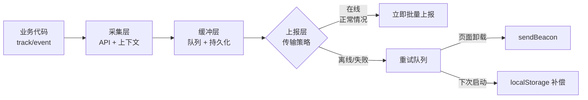
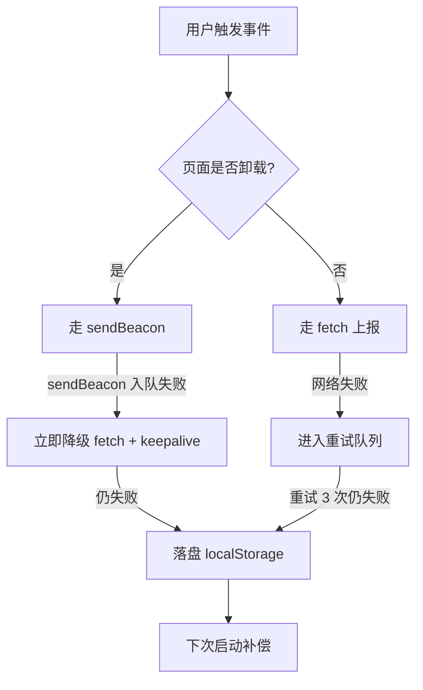

# 埋点 SDK 设计与上报机制（失败重试 / 补偿，可接 Network 的 sendBeacon）

[[toc]]

::::tip
:::tip
**一句话总结**：一个生产级埋点 SDK = **采集层（业务 API） + 缓冲层（队列 & 持久化） + 上报层（4 种传输方式 + 重试补偿）**。本文从架构设计到完整代码实现，逐层拆解一个可上线使用的轻量埋点 SDK。
:::
::::

## 一、为什么需要自研 SDK

:::warning 现实情况
**99% 的项目直接用神策 / GrowingIO / Sentry / 阿里云 ARMS 的官方 SDK 即可**。只有在以下情况才考虑自研：

| 场景 | 原因 |
| :--- | :--- |
| 公司有多个端（Web、小程序、原生 App），想统一上报协议 | 减少重复开发 |
| 第三方 SDK 体积太大（>30KB），影响首屏 | 自研可压到 5-10KB |
| 业务数据极度敏感，不能走第三方 | 数据自主可控 |
| 有特殊的采集需求（如 canvas 点击热区、WebGL 交互） | 第三方覆盖不到 |

如果你不属于上面 4 种情况，**建议直接用第三方 SDK**。
:::

---

## 二、SDK 整体架构

一个完整的埋点 SDK 通常分为 3 层：



### 各层职责

| 层 | 职责 | 关键能力 |
| :--- | :--- | :--- |
| **采集层** | 接收业务事件、合并公共属性、补充上下文（UA、URL、时间） | API 简洁、自动上下文 |
| **缓冲层** | 内存队列聚合、定时 flush、失败时持久化到 localStorage | 批量上报、断网暂存 |
| **上报层** | 选最优传输方式（img/sendBeacon/fetch/XHR）、失败重试、退出补偿 | 高送达率、低侵入 |

---

## 三、采集层设计

### 3.1 核心 API 设计

埋点 SDK 对业务暴露的 API 必须**极简**，最好是两个方法 + 几个配置：

```typescript
// 1. 初始化（应用启动时调用一次）
sensors.init({
  server_url: 'https://data.example.com/sa',
  project: 'my_web',
  batch_size: 10,         // 每批上报条数
  send_timeout: 5000,      // 单次上报超时
  debug: false
});

// 2. 用户登录（设置 distinct_id）
sensors.login('user_123');

// 3. 设置公共属性（每次事件都会带上）
sensors.registerPage({ platform: 'web', app_version: '1.2.0' });

// 4. 业务事件上报
sensors.track('ButtonClick', { button_name: '提交订单' });
```

### 3.2 自动补充上下文

每次 `track()` 时，SDK 自动补全以下字段（业务无需关心）：

```javascript
{
  distinct_id: 'user_123',
  event: 'ButtonClick',
  time: 1731234567890,                    // 毫秒时间戳
  $url: location.href,
  $referrer: document.referrer,
  $user_agent: navigator.userAgent,
  $screen_width: window.screen.width,
  $screen_height: window.screen.height,
  // ... 业务自定义属性
  button_name: '提交订单'
}
```

### 3.3 采集层完整实现

```typescript
class Collector {
  private commonProps: Record<string, any> = {};
  private distinctId: string = '';

  constructor(private buffer: Buffer) {}

  // 设置用户标识
  login(id: string) {
    this.distinctId = id;
  }

  // 注册公共属性
  registerPage(props: Record<string, any>) {
    this.commonProps = { ...this.commonProps, ...props };
  }

  // 核心 API：上报事件
  track(event: string, properties: Record<string, any> = {}) {
    const data = {
      event,
      distinct_id: this.distinctId || this.getAnonymousId(),
      time: Date.now(),
      // 自动补充上下文
      $url: location.href,
      $referrer: document.referrer,
      $user_agent: navigator.userAgent,
      // 合并公共属性 + 业务属性（业务属性优先级更高）
      ...this.commonProps,
      ...properties
    };

    // 推入缓冲层
    this.buffer.push(data);
  }

  private getAnonymousId(): string {
    let id = localStorage.getItem('_sdk_anonymous_id');
    if (!id) {
      id = `anon_${Date.now()}_${Math.random().toString(36).slice(2)}`;
      localStorage.setItem('_sdk_anonymous_id', id);
    }
    return id;
  }
}
```

---

## 四、缓冲层设计（关键中的关键）

缓冲层是整个 SDK 的**心脏**。它的目标是：**尽可能批量、尽可能异步、尽可能可靠**。

### 4.1 三个核心机制

| 机制 | 作用 | 触发条件 |
| :--- | :--- | :--- |
| **批量聚合** | 减少请求次数、降低网络开销 | 队列长度达到 `batch_size` |
| **定时 flush** | 保证低频事件也能上报 | 每隔 `flush_interval` ms（默认 5000） |
| **离线持久化** | 浏览器关闭后事件不丢失 | 队列超过内存阈值 / 主动持久化 |

### 4.2 缓冲层完整实现

```typescript
type EventData = Record<string, any>;

interface BufferOptions {
  batch_size: number;
  flush_interval: number;     // ms
  max_memory_size: number;   // 内存最大条数
}

class Buffer {
  private queue: EventData[] = [];
  private timer: number | null = null;

  constructor(
    private reporter: Reporter,
    private options: BufferOptions
  ) {
    // 启动定时 flush
    this.timer = window.setInterval(() => this.flush(), options.flush_interval);

    // 启动时加载上次未上报的事件（补偿）
    this.loadPersisted();
  }

  // 推入事件
  push(event: EventData) {
    this.queue.push(event);

    // 达到批量阈值，立即触发上报
    if (this.queue.length >= this.options.batch_size) {
      this.flush();
      return;
    }

    // 超过内存阈值，落盘
    if (this.queue.length >= this.options.max_memory_size) {
      this.persist();
    }
  }

  // 批量上报
  flush() {
    if (this.queue.length === 0) return;

    // 取出当前队列，并立即清空（防止上报期间新事件丢失）
    const batch = this.queue.splice(0, this.options.batch_size);

    this.reporter.send(batch).then(success => {
      if (!success) {
        // 上报失败：把失败的事件持久化到 localStorage，下次启动补偿
        this.saveFailedBatch(batch);
      }
    });
  }

  // 内存队列过长时落盘（防止 OOM）
  private persist() {
    const toDisk = this.queue.splice(0);
    this.saveFailedBatch(toDisk);
  }

  // localStorage 持久化（用队列形式追加，避免覆盖未发送的事件）
  private saveFailedBatch(batch: EventData[]) {
    try {
      const key = '_sdk_pending_events';
      const existing = JSON.parse(localStorage.getItem(key) || '[]');
      const merged = existing.concat(batch);
      // 限制 localStorage 容量，最多保留 500 条
      localStorage.setItem(key, JSON.stringify(merged.slice(-500)));
    } catch (e) {
      // localStorage 满 / 不可用时，静默丢弃（业务方可通过 debug 模式排查）
      console.warn('[SDK] persist failed', e);
    }
  }

  // 应用启动时补偿上次未发的事件
  private loadPersisted() {
    try {
      const key = '_sdk_pending_events';
      const pending = JSON.parse(localStorage.getItem(key) || '[]');
      if (pending.length > 0) {
        // 重新入缓冲队列，会通过正常的 flush 逻辑上报
        this.queue.unshift(...pending);
        localStorage.removeItem(key);
      }
    } catch (e) {
      console.warn('[SDK] load persisted failed', e);
    }
  }

  destroy() {
    if (this.timer) window.clearInterval(this.timer);
  }
}
```

---

## 五、上报层设计（重点）

### 5.1 4 种上报方式对比

| 方式 | 兼容性 | 页面卸载仍能发 | 可发大数据 | 推荐场景 |
| :--- | :--- | :--- | :--- | :--- |
| **`new Image()`** | ⭐⭐⭐⭐⭐ | ❌ | ❌（URL 长度限制） | 兜底方案 |
| **`navigator.sendBeacon()`** | ⭐⭐⭐⭐（IE 不支持） | ✅ | ✅ | **页面卸载时上报（首选）** |
| **`fetch({ keepalive: true })`** | ⭐⭐⭐⭐（Safari < 14 不支持） | ✅ | ✅ | 现代浏览器、跨域复杂场景 |
| **`XMLHttpRequest`** | ⭐⭐⭐⭐⭐ | ❌ | ✅ | 兜底 / 老旧浏览器 |

:::tip 选型原则
**正常运行时**：用 `fetch` 或 `Image`（速度快）。

**页面卸载时**（unload / beforeunload / pagehide）：**必须用 `sendBeacon`** 或 `fetch + keepalive`，其他方式会被浏览器取消。
:::

### 5.2 重试机制（指数退避）

网络抖动是常态，不能一次失败就放弃：

```typescript
interface RetryOptions {
  max_retries: number;       // 最大重试次数（默认 3）
  base_delay: number;        // 基础延迟（默认 500ms）
  max_delay: number;         // 最大延迟（默认 30000ms）
}

class Reporter {
  // 发送一批事件，失败时自动重试
  async send(batch: EventData[], retryCount = 0): Promise<boolean> {
    try {
      await this._send(batch);
      return true;
    } catch (e) {
      if (retryCount >= this.retryOptions.max_retries) {
        console.warn('[SDK] max retries reached, drop batch', e);
        return false; // 让上层持久化兜底
      }

      // 指数退避：base_delay * 2^retryCount，加随机抖动避免雷暴
      const delay = Math.min(
        this.retryOptions.base_delay * Math.pow(2, retryCount),
        this.retryOptions.max_delay
      );
      const jitter = Math.random() * 1000; // 0~1s 随机抖动

      await new Promise(resolve => setTimeout(resolve, delay + jitter));

      return this.send(batch, retryCount + 1);
    }
  }

  private async _send(batch: EventData[]): Promise<void> {
    // 实际发送逻辑（见 5.3 节）
  }
}
```

**指数退避示意**：

```
第1次失败 → 等待 500ms + 随机抖动
第2次失败 → 等待 1000ms + 随机抖动
第3次失败 → 等待 2000ms + 随机抖动
达到 max_retries → 进入持久化队列，等待下次启动补偿
```

### 5.3 上报层完整实现（含场景适配）

```typescript
class Reporter {
  constructor(
    private server_url: string,
    private retryOptions: RetryOptions
  ) {}

  // 内部发送：根据场景选最优方式
  private async _send(batch: EventData[]): Promise<void> {
    const payload = JSON.stringify({
      project: 'my_web',
      data: batch
    });

    // 场景 1：页面卸载 → sendBeacon（不会阻塞 unload）
    if (this.isPageUnloading()) {
      this.sendBeacon(payload);
      return;
    }

    // 场景 2：跨域复杂 + 大数据 → fetch
    if (this.shouldUseFetch(batch)) {
      await this.fetchWithTimeout(payload, 5000);
      return;
    }

    // 场景 3：兜底 → Image Beacon（兼容性最好）
    this.imageBeacon(payload);
  }

  // sendBeacon 实现（页面卸载场景首选）
  private sendBeacon(payload: string): boolean {
    if (!navigator.sendBeacon) return false;
    const blob = new Blob([payload], { type: 'application/json' });
    return navigator.sendBeacon(this.server_url, blob);
  }

  // fetch 实现（带超时控制）
  private async fetchWithTimeout(payload: string, timeout: number): Promise<void> {
    const controller = new AbortController();
    const timer = setTimeout(() => controller.abort(), timeout);

    try {
      const res = await fetch(this.server_url, {
        method: 'POST',
        body: payload,
        headers: { 'Content-Type': 'application/json' },
        keepalive: true, // 即使页面后续卸载，也保证完成
        signal: controller.signal
      });

      if (!res.ok) throw new Error(`HTTP ${res.status}`);
    } finally {
      clearTimeout(timer);
    }
  }

  // Image Beacon 实现（兜底方案）
  private imageBeacon(payload: string) {
    // Image Beacon 有 URL 长度限制（约 2KB），超长时降级到 fetch
    if (payload.length > 2000) {
      console.warn('[SDK] payload too large, fallback to fetch');
      return this.fetchWithTimeout(payload, 5000);
    }

    const img = new Image(1, 1);
    const params = encodeURIComponent(payload);
    img.src = `${this.server_url}?data=${params}`;

    img.onerror = () => {
      throw new Error('Image Beacon failed');
    };
  }

  private isPageUnloading(): boolean {
    // 通过全局标记位判断（在卸载事件中设置）
    return (window as any).__sdk_unloading__ === true;
  }

  private shouldUseFetch(batch: EventData[]): boolean {
    // 超过 4KB 的数据走 fetch（Get 不限制长度，Image 限制 2KB）
    const size = JSON.stringify(batch).length;
    return size > 4096 && 'fetch' in window;
  }
}
```

---

## 六、补偿机制（页面退出 / 崩溃）

页面关闭时，正在上报的事件可能被浏览器**直接砍掉**。这是埋点**最严重的丢失场景**。

### 6.1 三层防护



### 6.2 监听页面生命周期

```typescript
class SDK {
  constructor() {
    this.installUnloadHooks();
  }

  private installUnloadHooks() {
    // 标记位，让 Reporter 知道应该用 sendBeacon
    const markUnloading = () => {
      (window as any).__sdk_unloading__ = true;
      // 关键：unload 触发时强制 flush 一次（把当前队列里所有事件立刻发出去）
      this.buffer.flush();
    };

    // 现代浏览器推荐用 pagehide（兼容性最好）
    window.addEventListener('pagehide', markUnloading);

    // 兼容老浏览器
    window.addEventListener('beforeunload', markUnloading);

    // 移动端特有：visibilitychange + hidden 时也要 flush
    document.addEventListener('visibilitychange', () => {
      if (document.visibilityState === 'hidden') {
        markUnloading();
      }
    });
  }
}
```

:::warning 关键点
**`unload` 事件不可靠**——很多浏览器（特别是 Safari）不会触发。**优先用 `pagehide`** + `visibilitychange` 双保险。
:::

### 6.3 处理崩溃场景

页面崩溃（JS 报错、OOM、断网）时，`pagehide` 根本来不及触发。这时候只能靠**下次启动时补偿**：

```typescript
// 应用启动时执行
class SDK {
  private async init() {
    // 1. 先补偿上次未上报的事件
    await this.buffer.compensate();

    // 2. 再开始正常接收事件
    this.collector = new Collector(this.buffer);
  }
}
```

`compensate()` 就是 4.2 节里的 `loadPersisted()`——把 localStorage 里残留的事件重新入队，按正常逻辑上报。

---

## 七、SDK 完整组装

把上面 3 层串起来：

```typescript
// 业务方只需要 import 这个 sdk
class SDK {
  private buffer!: Buffer;
  private reporter!: Reporter;
  private collector!: Collector;

  init(config: {
    server_url: string;
    project: string;
    batch_size?: number;
    flush_interval?: number;
  }) {
    // 1. 实例化上报层
    this.reporter = new Reporter(config.server_url, {
      max_retries: 3,
      base_delay: 500,
      max_delay: 30000
    });

    // 2. 实例化缓冲层
    this.buffer = new Buffer(this.reporter, {
      batch_size: config.batch_size ?? 10,
      flush_interval: config.flush_interval ?? 5000,
      max_memory_size: 200
    });

    // 3. 实例化采集层
    this.collector = new Collector(this.buffer);

    // 4. 安装生命周期钩子
    this.installUnloadHooks();
  }

  // 暴露给业务的方法
  login(id: string) { this.collector.login(id); }
  registerPage(props: any) { this.collector.registerPage(props); }
  track(event: string, props?: any) { this.collector.track(event, props); }
}

// 单例导出
export const sensors = new SDK();
```

**业务使用**：

```typescript
import { sensors } from './sdk';

// 1. 应用启动时初始化
sensors.init({ server_url: 'https://data.example.com/sa', project: 'my_web' });

// 2. 用户登录
sensors.login('user_123');

// 3. 设置公共属性
sensors.registerPage({ app_version: '1.2.0' });

// 4. 业务事件
sensors.track('ButtonClick', { button_name: '提交订单' });
```

---

## 八、避坑指南（生产踩过的坑）

| 坑 | 现象 | 解决 |
| :--- | :--- | :--- |
| **sendBeacon 失败无回调** | 不知道数据是否到达 | sendBeacon 返回 `false` 时降级 fetch + keepalive |
| **localStorage 满** | `QuotaExceededError` | 限制最大条数（500）；优先用 `try/catch` 兜底 |
| **跨域 CORS** | fetch 报 CORS error | 让后端埋点接口返回 `Access-Control-Allow-Origin: *`；或用 Image Beacon 天然无跨域 |
| **SDK 体积过大** | 影响首屏 LCP | 按需引入（mermaid 等仅 debug 模式打包）；用 gzip 后 < 10KB |
| **循环引用** | 事件对象里包含 `window`、`document` 等 | JSON.stringify 时**先过滤**，剔除函数、DOM 引用、循环引用 |
| **敏感数据上报** | 不小心把密码 / token 埋进属性 | SDK 内部对 key 黑名单过滤（如 `password`、`token`、`secret`） |

### 敏感数据过滤示例

```typescript
const SENSITIVE_KEYS = /password|token|secret|cookie|authorization/i;

function safeData(data: Record<string, any>): Record<string, any> {
  const result: Record<string, any> = {};
  for (const key in data) {
    if (SENSITIVE_KEYS.test(key)) {
      result[key] = '***'; // 替换为星号
    } else {
      result[key] = data[key];
    }
  }
  return result;
}

// 在 track() 里调用
track(event: string, properties: Record<string, any> = {}) {
  const data = { ..., ...safeData(properties) };
  this.buffer.push(data);
}
```

---

## 九、什么时候用 sendBeacon

参考前文 Network/安全与数据上报/添加埋点方式和原理.md，sendBeacon 是**页面卸载时**上报的首选。但它的限制也很明显：

| 限制 | 说明 |
| :--- | :--- |
| ❌ **没有回调** | 无法知道是否成功，只能信任浏览器入队成功 |
| ❌ **IE 完全不支持** | 需要 `Image Beacon` 兜底 |
| ⚠️ **数据大小有限制** | 浏览器通常限制 64KB，超出会失败 |
| ⚠️ **POST 请求但 Content-Type 受限** | 推荐 `application/json` 或 `text/plain` |

**结论**：把 sendBeacon 作为**页面卸载 / 隐藏时的保底手段**，正常运行时用 fetch（更可控）。

---

## 十、总结：SDK 设计的 5 个原则

1. **分层清晰**：采集 / 缓冲 / 上报 三层解耦，每层可独立测试和替换
2. **失败兜底**：任何一层失败都有补救方案（重试 → 持久化 → 下次补偿）
3. **场景适配**：根据是否页面卸载、是否大数据、是否跨域选最优上报方式
4. **数据安全**：敏感字段过滤 + 循环引用 + DOM 引用防御性过滤
5. **体积可控**：核心 SDK < 10KB（gzip），debug 模块按需加载

掌握了这些，你就已经具备**从零写一个生产级埋点 SDK**的能力。剩下就是针对业务场景的细节调优（采样率、白名单、灰度等），本文不再展开。