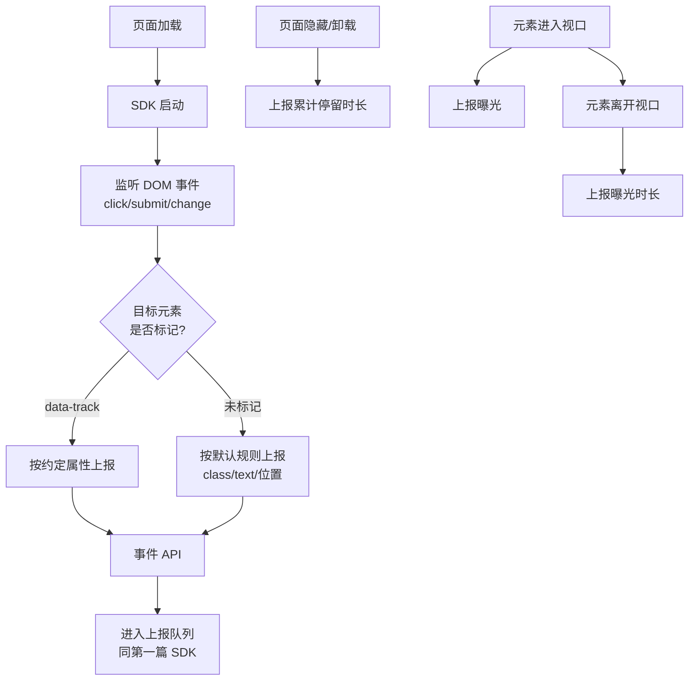
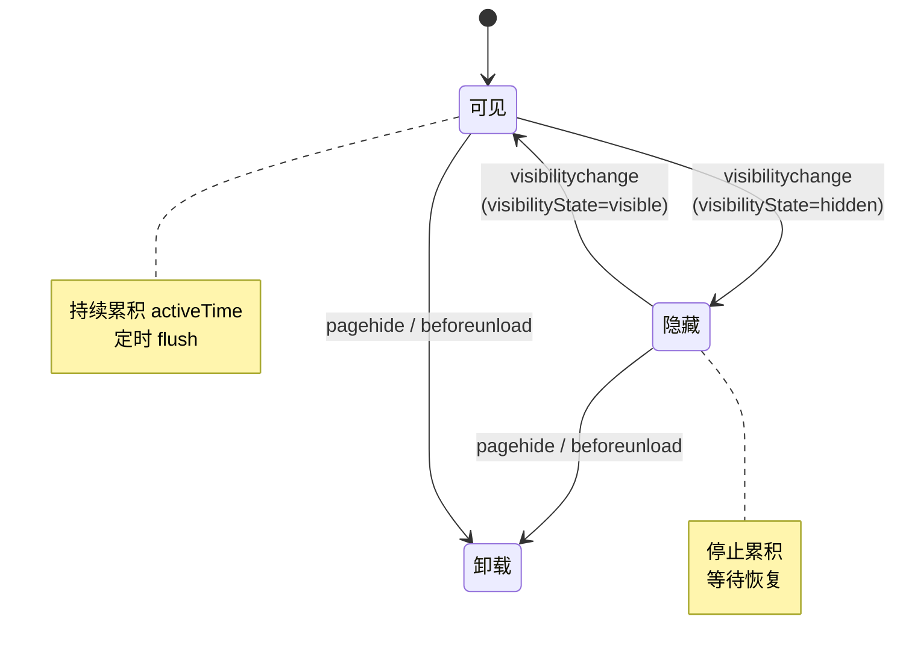

# 无痕（全）埋点实现原理、曝光埋点与停留时长统计

[[toc]]

::::tip
:::tip
**一句话总结**：**无痕埋点** = 业务代码**零侵入**地自动捕获用户行为，**曝光埋点** = 用 `IntersectionObserver` 监测元素可见性，**停留时长** = 用 `Page Visibility` 精确统计"有效浏览时间"。三者结合，构成了现代前端精细化运营的基石。
:::
::::

## 一、什么是无痕埋点

:::info 核心定义
**无痕埋点（也叫全埋点、自动埋点）** 是指：**业务代码不需要写 `sensors.track(...)`，SDK 自动监听 DOM 事件，捕获所有可埋点的用户行为**。

业务方只需在元素上加约定的 `data-*` 属性（或无属性时按全量捕获），SDK 就能"自己动手"完成上报。
:::

### 1.1 与手动埋点的对比

| 维度 | 手动埋点 | 无痕埋点 |
| :--- | :--- | :--- |
| **业务侵入性** | 高（每个事件都要写 `track`） | 几乎为零（SDK 自动） |
| **覆盖度** | 看开发严谨度（容易漏） | 100% 覆盖（DOM 事件不漏） |
| **数据精度** | 高（可带丰富业务上下文） | 一般（只有元素位置、文本、类名） |
| **维护成本** | 高（改流程要改埋点） | 低（SDK 升级即可） |
| **适用阶段** | 业务成熟期、转化漏斗关键路径 | 产品初期、需要快速采集大盘数据 |

:::tip 最佳实践
**手动 + 无痕结合**：关键路径用手动埋点（精确、可带业务字段），其他场景用无痕埋点（覆盖全、零成本）。
:::

---

## 二、无痕埋点的实现原理

### 2.1 整体架构



### 2.2 三种埋点方式的覆盖矩阵

| 行为类型 | 手动埋点 | 无痕埋点 | SDK 自动 |
| :--- | :--- | :--- | :--- |
| **关键按钮点击** | ✅ 必备 | ✅ 自动 | SDK 监听 click |
| **页面浏览（PV）** | 可选 | ✅ 自动 | SDK 监听路由变化 |
| **表单提交** | 可选 | ✅ 自动 | SDK 监听 submit |
| **曝光（可见性）** | 可选 | ✅ 自动 | SDK 用 IntersectionObserver |
| **停留时长** | 可选 | ✅ 自动 | SDK 用 Page Visibility |
| **业务自定义事件**（如加入购物车） | ✅ 必备 | ❌ | — |

---

## 三、自动捕获点击事件

### 3.1 事件代理（核心思想）

不要给每个元素都绑定监听器，**只用 document 监听一次**，通过 `event.target` 冒泡获取实际元素：

```typescript
// ❌ 错误做法：每个按钮都绑定
document.querySelectorAll('button').forEach(btn => {
  btn.addEventListener('click', handler);
});

// ✅ 正确做法：事件代理
document.addEventListener('click', (e) => {
  const target = e.target as HTMLElement;
  // 找到最近的埋点标记元素（兼容嵌套 DOM）
  const trackEl = target.closest('[data-track]');
  if (trackEl) {
    trackEvent('click', trackEl);
  }
});
```

### 3.2 提取元素信息

SDK 需要自动从元素上提取"是什么被点了"：

```typescript
function extractElementInfo(el: HTMLElement) {
  return {
    // 业务约定的标记
    track_id: el.dataset.track,                    // data-track="submit_order"
    track_params: el.dataset.trackParams,          // data-track-params='{"order_id":"123"}'

    // 自动推断的标识
    tag: el.tagName.toLowerCase(),                  // button
    text: el.textContent?.trim().slice(0, 50),      // 截断防止超长
    class_name: el.className,
    id: el.id,
    selector: generateSelector(el),                 // body > div > button:nth-child(2)

    // 位置信息（用于热力图）
    x: Math.round(el.getBoundingClientRect().left),
    y: Math.round(el.getBoundingClientRect().top)
  };
}

// 生成稳定的 CSS 选择器（用于定位元素）
function generateSelector(el: HTMLElement): string {
  if (el.id) return `#${el.id}`;
  if (el.className) return `.${el.className.split(' ').join('.')}`;

  const path: string[] = [];
  let cur: HTMLElement | null = el;
  while (cur && cur.tagName !== 'BODY') {
    path.unshift(cur.tagName.toLowerCase());
    cur = cur.parentElement;
  }
  return path.join(' > ');
}
```

### 3.3 完整的点击无痕埋点

```typescript
class AutoTracker {
  constructor(private collector: Collector) {
    this.installClickTracker();
    this.installSubmitTracker();
    this.installChangeTracker();
  }

  // 点击事件捕获
  private installClickTracker() {
    document.addEventListener('click', (e) => {
      const target = e.target as HTMLElement;
      const trackEl = target.closest('[data-track], button, a');

      if (!trackEl) return;

      const info = extractElementInfo(trackEl);
      const eventName = info.track_id || `${info.tag}_click`;

      // 优先用业务自定义参数
      let params: Record<string, any> = {};
      if (info.track_params) {
        try { params = JSON.parse(info.track_params); } catch {}
      }

      this.collector.track(eventName, {
        ...params,
        element: info
      });
    }, { capture: true }); // 捕获阶段，保证比业务代码先执行
  }

  // 表单提交捕获
  private installSubmitTracker() {
    document.addEventListener('submit', (e) => {
      const form = e.target as HTMLFormElement;
      const trackId = form.dataset.track || 'form_submit';

      this.collector.track(trackId, {
        form_id: form.id,
        form_action: form.action,
        form_method: form.method,
        // 注意：不要上报具体字段值（可能含敏感信息）
        field_count: form.elements.length
      });
    }, { capture: true });
  }

  // 输入变化捕获（如搜索框、下拉选择）
  private installChangeTracker() {
    let timer: number | null = null;
    document.addEventListener('change', (e) => {
      const target = e.target as HTMLElement;
      // 只埋特定的交互元素，避免误埋（密码框、单选等）
      if (!['INPUT', 'SELECT', 'TEXTAREA'].includes(target.tagName)) return;

      // 防抖：连续 change 只埋一次
      clearTimeout(timer!);
      timer = window.setTimeout(() => {
        const input = target as HTMLInputElement;
        this.collector.track('input_change', {
          input_type: input.type,
          input_name: input.name,
          // 严格过滤 value，防止上报密码等敏感信息
          has_value: !!input.value,
          value_length: input.value?.length || 0
        });
      }, 500);
    }, { capture: true });
  }
}
```

### 3.4 业务标记示例

```html
<!-- 关键按钮：手动指定事件名 + 参数 -->
<button
  data-track="submit_order"
  data-track-params='{"order_id":"12345","amount":99}'
>提交订单</button>

<!-- 普通按钮：不标记，SDK 用默认规则 (button_click + 元素信息) -->
<button>取消</button>

<!-- 表单 -->
<form data-track="signup_form" action="/api/signup" method="post">
  <input name="email" />
  <input name="password" type="password" /> <!-- 密码不会被上报 value -->
  <button type="submit">注册</button>
</form>
```

---

## 四、PV（页面浏览）无痕埋点

### 4.1 SPA 路由监听

传统 MPA 页面，`window.onload` + 监听 `pageshow` 事件就够了。但 SPA 路由切换不刷新页面，必须监听 `history.pushState`：

```typescript
class PVTracker {
  private currentUrl: string = location.href;

  start() {
    // 1. 上报首次进入页面的 PV
    this.reportPV();

    // 2. 劫持 history 方法（SPA 路由切换的核心）
    const originalPushState = history.pushState;
    history.pushState = (...args) => {
      originalPushState.apply(history, args);
      this.onRouteChange();
    };

    window.addEventListener('popstate', () => this.onRouteChange());
    window.addEventListener('hashchange', () => this.onRouteChange());
  }

  private onRouteChange() {
    if (location.href === this.currentUrl) return; // 防止重复上报

    // 先上报上一页的停留时长（详见第五节）
    durationTracker.flush();
    this.currentUrl = location.href;
    this.reportPV();
  }

  private reportPV() {
    this.collector.track('$pageview', {
      $url: location.href,
      $referrer: document.referrer,
      $title: document.title
    });
  }
}
```

### 4.2 Next.js / Vue Router 适配

现代框架的路由切换走自己的 history，`pushState` 劫持可能失效。可以用 **路由钩子**：

```typescript
// Next.js (pages router)
import { useRouter } from 'next/router';
useEffect(() => {
  const handleRouteChange = (url: string) => {
    sensors.track('$pageview', { $url: url });
  };
  router.events.on('routeChangeComplete', handleRouteChange);
  return () => router.events.off('routeChangeComplete', handleRouteChange);
}, []);

// Vue Router
router.afterEach((to, from) => {
  sensors.track('$pageview', {
    $url: to.fullPath,
    $referrer: from.fullPath
  });
});
```

---

## 五、停留时长统计（难点）

停留时长是最容易**数据失真**的埋点类型——用户切到后台、锁屏、最小化窗口，浏览器会暂停甚至丢弃 `setInterval`。

### 5.1 核心原理



### 5.2 用 `document.visibilityState` 替代 `setInterval`

```typescript
// ❌ 错误做法：setInterval 在后台会被节流（Chrome 后台最小 1s / 次），数据不准确
setInterval(() => {
  activeTime += 1000;
}, 1000);

// ✅ 正确做法：用 Page Visibility API 监听可见性切换
class DurationTracker {
  private activeStart: number = 0;
  private accumulated: number = 0;       // 当前页面已累积的停留毫秒数
  private currentUrl: string = location.href;
  private collector: Collector;

  start() {
    // 页面首次可见：开始计时
    if (document.visibilityState === 'visible') {
      this.activeStart = Date.now();
    }

    // 监听可见性切换
    document.addEventListener('visibilitychange', () => {
      if (document.visibilityState === 'hidden') {
        // 切到后台：暂停累积
        this.accumulated += Date.now() - this.activeStart;
        this.activeStart = 0;
      } else {
        // 重新可见：继续计时
        this.activeStart = Date.now();
      }
    });

    // 页面卸载：上报停留时长
    window.addEventListener('pagehide', () => this.flush());
    window.addEventListener('beforeunload', () => this.flush());

    // 兜底：每 30s 主动 flush 一次（防止 SPA 内路由切换时丢数据）
    setInterval(() => this.flush(), 30000);
  }

  // 主动 flush（用于 SPA 路由切换）
  flush() {
    let totalDuration = this.accumulated;
    if (this.activeStart > 0) {
      totalDuration += Date.now() - this.activeStart;
      this.activeStart = Date.now(); // 重置起点，避免下次重复累加
    }

    if (totalDuration < 100) return; // 太短不上报（< 100ms 视为无效）

    this.collector.track('$page_duration', {
      $url: this.currentUrl,
      duration_ms: totalDuration
    });

    this.accumulated = 0;
  }
}
```

### 5.3 关键点解释

| 问题 | 解决方案 |
| :--- | :--- |
| `setInterval` 后台被节流 | 用 `visibilitychange` 事件精确计算 |
| SPA 路由切换不刷新页面 | 提供 `flush()` 方法，让 PV 切换时手动调用 |
| 页面快速刷新（< 1s） | 加 `if (totalDuration < 100) return` 过滤 |
| 锁屏 / 后台超时被杀 | 用 `pagehide` 而不是 `unload`（兼容 Safari） |

---

## 七、曝光埋点（IntersectionObserver）

```typescript
class ExposureTracker {
  private observer: IntersectionObserver;

  constructor(private collector: Collector) {
    this.observer = new IntersectionObserver(
      (entries) => this.handleEntries(entries),
      {
        // 元素可见 50% 就算曝光
        threshold: 0.5,
        // 提前 100px 触发（优化用户感知）
        rootMargin: '0px 0px -100px 0px'
      }
    );
  }

  // 监听某个元素
  watch(el: HTMLElement, exposureId: string, extraProps: Record<string, any> = {}) {
    el.dataset.exposureId = exposureId;
    el._exposureStart = 0;
    el._exposureProps = extraProps;
    this.observer.observe(el);
  }

  private handleEntries(entries: IntersectionObserverEntry[]) {
    entries.forEach(entry => {
      const el = entry.target as HTMLElement & {
        _exposureStart?: number;
        _exposureProps?: Record<string, any>;
      };
      const exposureId = el.dataset.exposureId;
      if (!exposureId) return;

      if (entry.isIntersecting) {
        // 进入视口：开始计时
        el._exposureStart = Date.now();
      } else if (el._exposureStart) {
        // 离开视口：上报本次曝光时长
        const duration = Date.now() - el._exposureStart;
        el._exposureStart = 0;

        // 过滤太短的曝光（< 500ms 视为无效）
        if (duration < 500) return;

        this.collector.track('$exposure', {
          exposure_id: exposureId,
          exposure_duration_ms: duration,
          ...el._exposureProps
        });
      }
    });
  }

  destroy() {
    this.observer.disconnect();
  }
}
```

**业务使用**：

```html
<!-- 商品卡片：用 data-exposure-id 标记 -->
<div
  data-exposure-id="product_card_123"
  data-exposure-params='{"product_id":"P123","price":99}'
>
  商品名 / 图片 / 价格
</div>
```

```typescript
// 监听所有 [data-exposure-id] 元素
document.querySelectorAll('[data-exposure-id]').forEach(el => {
  const params = JSON.parse(el.dataset.exposureParams || '{}');
  exposureTracker.watch(el, el.dataset.exposureId!, params);
});

// 新增的 DOM 也要监听（比如无限滚动加载的商品）
const observer = new MutationObserver(() => {
  document.querySelectorAll('[data-exposure-id]:not([data-_observed])').forEach(el => {
    el.dataset._observed = '1';
    const params = JSON.parse(el.dataset.exposureParams || '{}');
    exposureTracker.watch(el, el.dataset.exposureId!, params);
  });
});
observer.observe(document.body, { childList: true, subtree: true });
```

---

## 八、完整无痕 SDK 整合

把上面 3 大模块（自动点击 + PV + 停留 + 曝光）打包成一个 `AutoCollector`，跟第一篇的 `Collector` 配合：

```typescript
import { sensors } from './sdk'; // 第一篇里的 SDK

class AutoCollector {
  private pvTracker: PVTracker;
  private durationTracker: DurationTracker;
  private exposureTracker: ExposureTracker;
  private autoTracker: AutoTracker;

  constructor() {
    this.pvTracker = new PVTracker(sensors);
    this.durationTracker = new DurationTracker(sensors);
    this.exposureTracker = new ExposureTracker(sensors);
    this.autoTracker = new AutoTracker(sensors);
  }

  start() {
    this.pvTracker.start();
    this.durationTracker.start();
    // AutoTracker 在构造函数里已经 install 了所有事件
  }
}

// 业务方调用一次即可
const autoCollector = new AutoCollector();
autoCollector.start();
```

---

## 九、避坑指南

| 坑 | 现象 | 解决 |
| :--- | :--- | :--- |
| **重复上报** | SPA 路由切换时 PV 上报多次 | 在 `onRouteChange` 里判断 `location.href !== currentUrl` |
| **元素信息泄露** | 自动捕获的 `textContent` 包含用户隐私 | SDK 内部过滤敏感字段（手机号、邮箱、身份证正则匹配） |
| **高频事件** | input change 一次输入触发几十次 | 加 500ms 防抖 |
| **曝光元素太多** | 1000 个商品卡都监听 IntersectionObserver | 滚动出视口 5s 后 disconnect（节省 CPU） |
| **iOS Safari 后台计时** | 锁屏后 `setInterval` 不准 | **不要用 setInterval 算时长**，用 `visibilitychange` |
| **iframe 嵌套** | 父子页面重复上报 PV | 检测 `window.top === window` 决定是否上报 |
| **`<br/>` 在 SVG `<text>`** | 部分浏览器把换行当成两次渲染 | 用 `&#10;` 或 `tspan` |

### 敏感字段过滤示例

```typescript
const SENSITIVE_REGEX = /1[3-9]\d{9}|[\w-]+@[\w-]+\.\w+|\d{17}[\dXx]/; // 手机号/邮箱/身份证

function safeText(text: string): string {
  return text.replace(SENSITIVE_REGEX, '***');
}

// 在 extractElementInfo 里调用
text: safeText(el.textContent?.trim().slice(0, 50) || ''),
```

---

## 十、总结

| 能力 | 关键 API | 难度 |
| :--- | :--- | :--- |
| **自动点击** | 事件代理 + `closest()` | ⭐ |
| **PV 自动埋点** | 劫持 `pushState` + `popstate` | ⭐⭐ |
| **停留时长** | `visibilitychange` + `pagehide` | ⭐⭐⭐ |
| **曝光埋点** | `IntersectionObserver` | ⭐⭐ |
| **完整 SDK** | 整合以上 + 配合第一篇的 SDK | ⭐⭐⭐⭐ |

**核心原则**：**手动埋点管"精度"，无痕埋点管"覆盖"，两者结合才是完整方案**。