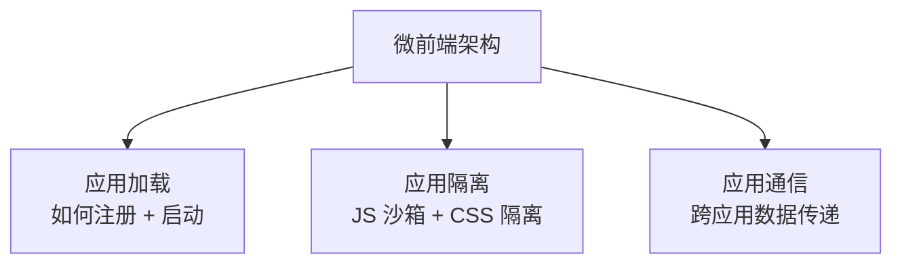
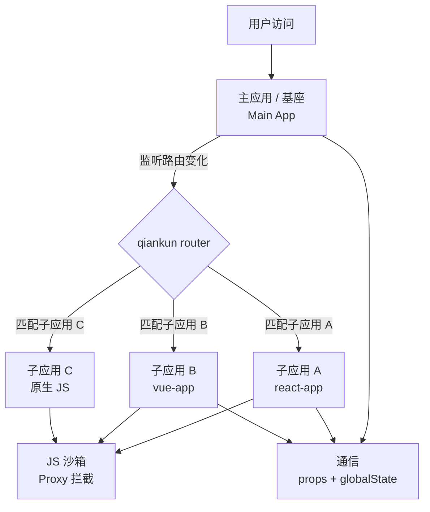
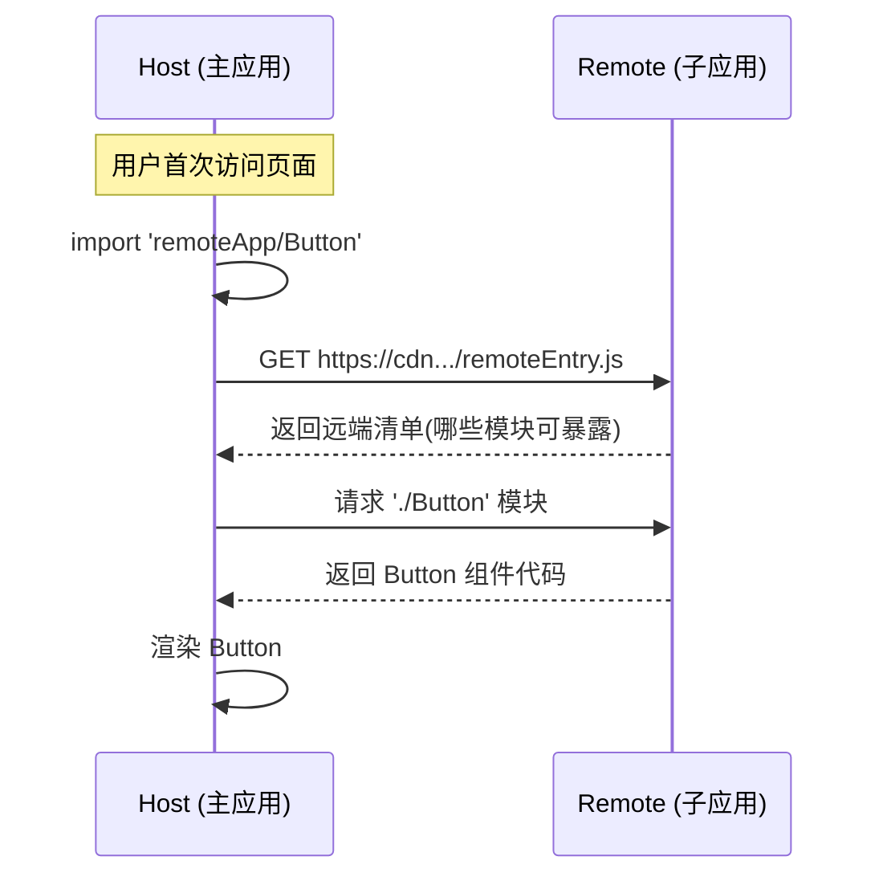
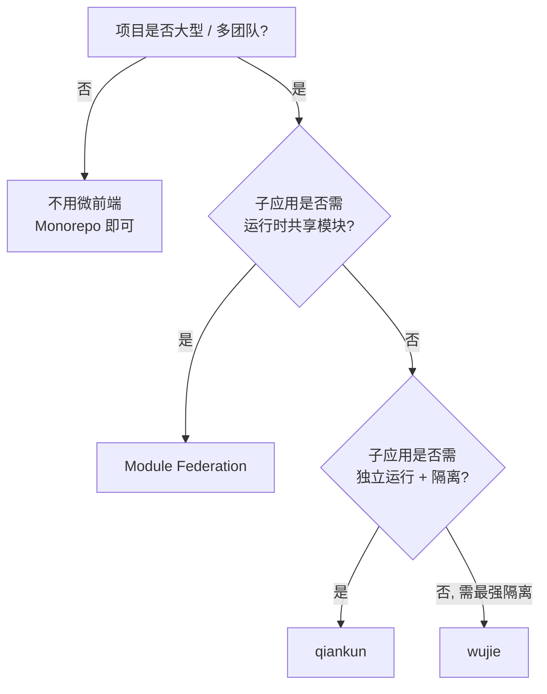

# 微前端方案对比与实践：从 qiankun 到 Module Federation

[[toc]]

## 一、什么是微前端

> 一句话：**微前端（Micro Frontends）是把后端"微服务"理念应用到前端**——把一个庞大的单体前端应用拆分成多个独立的小应用，每个小应用可以**独立选型、独立部署、独立运行**，最终聚合成一个完整产品。

:::tip 起源
**ThoughtWorks 在 2016 年提出微前端概念**，灵感来自后端微服务。它要解决的核心问题：

| 痛点 | 传统单体前端 | 微前端架构 |
|------|------------|----------|
| **代码庞大** | 一个仓库百万行代码 | 每个子应用几万行 |
| **构建慢** | 构建 10 分钟起步 | 各子应用独立构建，秒级 |
| **团队协作** | 多人改同一份代码，频繁冲突 | 各团队各管各的子应用 |
| **技术栈** | 全用 Vue / 全用 React | 各子应用可选不同技术栈 |
| **发布** | 任何改动都要整个发布 | 各子应用可独立发布 |
:::

### 1.1 适合 / 不适合微前端的判断

| 适合引入 | 不适合引入 |
|---------|----------|
| 多团队协作的项目（> 3 个团队） | 单一团队维护 |
| 项目庞大（> 50 个页面 + 复杂业务） | 页面少、功能单一 |
| 不同模块需要不同技术栈 | 技术栈统一更省心 |
| 各模块独立发布节奏 | 各模块强耦合、需频繁联动 |
| 中后台类应用 | C 端核心体验链路 |
| 已有存量应用，需要渐进改造 | 新建项目（直接 monorepo 更轻） |

> **口诀**：**项目大、团队多、独立发布需求** → 适合；否则引入微前端就是**过度工程化**。

---

## 二、微前端三大核心技术问题

不管选哪种方案，都绕不开 3 个核心问题：



### 2.1 应用加载

**问题**：基座（主应用）怎么知道有哪些子应用？怎么加载子应用的 JS、HTML、CSS？

**两种主流加载方式**：

| 方式 | 思路 | 代表方案 |
|------|------|---------|
| **路由分发式** | 基座监听路由变化，按路由加载对应子应用 | qiankun、single-spa |
| **模块联邦式** | 子应用作为 webpack module 被主应用运行时加载 | Module Federation |

### 2.2 应用隔离

**问题**：子应用 A 改 `window.foo = 1`，子应用 B 读到的是 1，**全局污染**怎么办？子应用 A 的样式污染子应用 B 怎么办？

| 隔离维度 | 隔离手段 |
|---------|---------|
| **JS 沙箱** | 快照沙箱 / Proxy 沙箱 / iframe 沙箱 |
| **CSS 隔离** | CSS Modules / Shadow DOM / 命名空间前缀 / BEM |
| **DOM 隔离** | 严格限定子应用挂载点 |

### 2.3 应用通信

**问题**：子应用 A 触发了某个事件，子应用 B 怎么知道？

| 通信方式 | 适用场景 |
|---------|---------|
| **URL query / hash** | 简单参数传递 |
| **Props / 回调** | 基座 → 子应用 |
| **全局事件总线** | 子应用 ↔ 子应用、基座 ↔ 子应用 |
| **共享状态（Redux/Pinia）** | 复杂共享数据 |
| **浏览器 Storage** | 跨域、持久化场景 |

---

## 三、四大主流方案对比

### 3.1 一句话总结

| 方案 | 一句话 |
|------|--------|
| **single-spa** | 微前端的"鼻祖"，只负责应用加载和卸载，不管隔离 |
| **qiankun** | 基于 single-spa，国内阿里出品，加了 JS 沙箱，开箱即用 |
| **Module Federation** | Webpack 5 / Rspack 原生支持的模块联邦，运行时共享模块 |
| **wujie** | 基于 Web Components + iframe 的新一代方案，零侵入 |

### 3.2 详细对比

| 维度 | single-spa | qiankun | Module Federation | wujie |
|------|-----------|--------|------------------|-------|
| **核心思路** | 应用注册 + 路由分发 | single-spa + JS 沙箱 | 运行时模块共享 | Web Components + iframe |
| **JS 沙箱** | ❌ 无 | ✅ Proxy / 快照 | ❌ 无（共用 window） | ✅ iframe 天然隔离 |
| **样式隔离** | ❌ 无 | ✅ 子应用样式自动加前缀 | ❌ 无 | ✅ iframe 天然隔离 |
| **子应用改造** | 需暴露 bootstrap/mount/unmount | 需暴露 bootstrap/mount/unmount | 无需暴露，但需用 webpack5/rspack | **零改造** |
| **技术栈** | 任意 | 任意 | 各应用需 webpack5/rspack | 任意 |
| **子应用能否独立运行** | ✅ 能 | ✅ 能 | ❌ 不能（必须宿主加载） | ✅ 能 |
| **性能** | 一般（HTML 解析开销） | 一般（同 single-spa） | **最优**（无 HTML 解析） | 较好（iframe 开销） |
| **通信** | 自定义（事件总线） | 自定义（props、globalState） | 直接 import（共享 ESM） | 自定义（事件总线） |
| **学习成本** | 中 | 低 | 中（要懂 webpack5） | 低 |
| **生态 / 社区** | 海外主流 | **国内最主流** | Webpack 官方 | 较新 |
| **代表用户** | 海外大厂 | 阿里集团、字节部分团队 | Shopify、Salesforce、字节 | 抖店 |
| **缺点** | 隔离弱 | 首屏加载较慢 | 必须用 webpack5 | iframe 性能损耗 |

---

## 四、qiankun 详解（国内最主流）

### 4.1 qiankun 原理

**架构示意**：



### 4.2 主应用配置（基座）

```typescript
// 主应用：main.ts
import { registerMicroApps, start, initGlobalState } from 'qiankun';
import { MicroAppStateActions } from 'qiankun';

// 1. 注册子应用
registerMicroApps([
  {
    name: 'react-app',                  // 子应用名（全局唯一）
    entry: '//localhost:7101',          // 子应用访问地址
    container: '#subapp-container',     // 子应用挂载节点
    activeRule: '/react',               // 激活路径
    props: {                            // 传给子应用的数据
      token: 'xxx',
      userInfo: { name: '张三' },
    },
  },
  {
    name: 'vue-app',
    entry: '//localhost:7102',
    container: '#subapp-container',
    activeRule: '/vue',
  },
]);

// 2. 全局状态（子应用可通过 props.getGlobalState() 访问）
const actions = initGlobalState({
  user: { name: '张三', role: 'admin' },
  token: 'xxx',
});

actions.onGlobalStateChange((state, prev) => {
  console.log('主应用监听全局状态变化', state, prev);
});

actions.setGlobalState({ token: 'new-token' }); // 修改全局状态

// 3. 启动 qiankun
start({
  prefetch: 'all',        // 预加载所有子应用
  sandbox: { strictStyleIsolation: true }, // 严格样式隔离
});
```

### 4.3 子应用改造（暴露生命周期）

无论子应用原来用什么框架（React / Vue / 原生），都要暴露 3 个方法：

```typescript
// 子应用：main.ts（React 17 为例）

// 1. 用 single-spa 的辅助函数包一层
import React from 'react';
import ReactDOM from 'react-dom';
import App from './App';

// 独立运行时的入口
function render(props: any) {
  const { container } = props;
  ReactDOM.render(<App />, container ? container.querySelector('#root') : document.querySelector('#root'));
}

// qiankun / single-spa 约定的 3 个生命周期
export async function bootstrap() {
  console.log('react-app bootstraped');
}

export async function mount(props: any) {
  console.log('props from main app', props);
  render(props);
}

export async function unmount(props: any) {
  const { container } = props;
  ReactDOM.unmountComponentAtNode(container ? container.querySelector('#root') : document.querySelector('#root'));
}

// 独立运行判断（非 qiankun 环境直接挂载）
if (!window.__POWERED_BY_QIANKUN__) {
  render({});
}
```

**Vue 子应用同理**，参考 qiankun 官方文档。

### 4.4 qiankun 的 JS 沙箱（Proxy 版）

qiankun 2.x 用 Proxy 拦截子应用的 `window` 访问：

```typescript
// 简化的 Proxy 沙箱实现思路
class ProxySandbox {
  private fakeWindow = {};
  private proxy: Window;

  constructor() {
    const that = this;
    this.proxy = new Proxy(fakeWindow, {
      get(target, key) {
        // 优先返回沙箱自己的属性
        if (key in target) return target[key];
        // 否则返回真实 window 的
        return window[key];
      },
      set(target, key, value) {
        // 子应用只能改"自己的 window"，不影响主应用
        target[key] = value;
        return true;
      },
    });
  }
}
```

**效果**：子应用 `window.foo = 1`，主应用读 `window.foo` 仍是 `undefined`。

---

## 五、Module Federation 详解（Webpack 5 原生）

### 5.1 核心思路

**Module Federation（MF）** 是 Webpack 5 内置特性：**应用 A 可以在运行时加载应用 B 的某个模块**，就像本地 import 一样。

### 5.2 应用角色

| 角色 | 作用 |
|------|------|
| **Host（宿主）** | 加载并消费其他应用的模块 |
| **Remote（远端）** | 暴露模块给其他应用消费 |
| **Bidirectional（双向）** | 同时是 Host 和 Remote |

### 5.3 Remote 应用配置（暴露模块）

```typescript
// webpack.config.js —— Remote 端（被消费的应用）
const { ModuleFederationPlugin } = require('webpack').container;

module.exports = {
  plugins: [
    new ModuleFederationPlugin({
      name: 'remoteApp',                              // 应用名
      filename: 'remoteEntry.js',                     // 入口文件
      exposes: {
        // 暴露的模块路径（其他应用按这个路径 import）
        './Button': './src/components/Button',
        './utils': './src/utils',
      },
      shared: {
        // 共享依赖（避免重复加载）
        react: { singleton: true },
        'react-dom': { singleton: true },
      },
    }),
  ],
};
```

### 5.4 Host 应用配置（消费模块）

```typescript
// webpack.config.js —— Host 端（主应用）
const { ModuleFederationPlugin } = require('webpack').container;

module.exports = {
  plugins: [
    new ModuleFederationPlugin({
      name: 'hostApp',
      remotes: {
        // 声明远端应用（必须和 remote 端 name 一致）
        remoteApp: 'remoteApp@https://cdn.example.com/remoteEntry.js',
      },
      shared: {
        react: { singleton: true },
        'react-dom': { singleton: true },
      },
    }),
  ],
};
```

```typescript
// Host 应用代码：像本地模块一样 import
import { Button } from 'remoteApp/Button';  // 运行时从 CDN 拉取
import { formatDate } from 'remoteApp/utils';

function App() {
  return <Button onClick={() => alert(formatDate(new Date()))}>Click</Button>;
}
```

### 5.5 MF 的"运行时模块加载"



### 5.6 MF vs qiankun 关键区别

| 维度 | qiankun | Module Federation |
|------|---------|------------------|
| **共享粒度** | 整个应用级别（HTML + JS + CSS） | **模块级别**（单个组件、工具函数） |
| **HTML 解析** | 需要（加载子应用 HTML） | **不需要**（直接是 ESM） |
| **子应用改造** | 需暴露生命周期 | 无暴露，但必须用 webpack5/rspack |
| **首屏性能** | 一般 | **最优** |
| **样式 / JS 隔离** | ✅ 有沙箱 | ❌ 共用全局（需自行处理） |
| **技术栈** | 任意 | 必须 webpack5 / Rspack / Vite (实验性) |

:::tip 实战选型
- 想 **"完整子应用"隔离** → qiankun
- 想 **"运行时共享组件/工具"** → Module Federation
- 想 **"两者结合"** → 用 qiankun 加载子应用，子应用内部用 MF 共享模块
:::

---

## 六、应用间通信方案

### 6.1 qiankun 的通信机制

**主应用**：

```typescript
import { initGlobalState } from 'qiankun';

// 初始化全局状态
const actions = initGlobalState({ user: { name: '张三' } });

// 主应用监听
actions.onGlobalStateChange((state) => {
  console.log('state changed:', state);
});

// 主应用主动设置
actions.setGlobalState({ token: 'new-token' });
```

**子应用**（在 `mount(props)` 里通过 props 拿到）：

```typescript
export async function mount(props: any) {
  // props.onGlobalStateChange 监听
  props.onGlobalStateChange((state) => {
    console.log('子应用收到 global state', state);
  });

  // props.setGlobalState 修改
  props.setGlobalState({ pageNumber: 1 });
}
```

### 6.2 MF 的通信机制（共享模块模式）

```typescript
// remoteApp 暴露一个全局状态模块
// shared-store/src/store.ts
export const store = {
  state: { count: 0 },
  setState(newState: any) {
    this.state = { ...this.state, ...newState };
    // 触发自定义事件
    window.dispatchEvent(new CustomEvent('store-changed', { detail: this.state }));
  },
};

// Host 应用消费
import { store } from 'remoteApp/store';
store.setState({ count: store.state.count + 1 });
```

### 6.3 通信方式对比

| 方式 | 数据流向 | 适用 |
|------|---------|------|
| **URL query** | 主 → 子（一次性参数） | 路由传参 |
| **props** | 主 → 子（按需） | qiankun 标准 |
| **globalState** | 双向 | qiankun 共享数据 |
| **CustomEvent** | 双向 | MF / 跨框架 |
| **Shared Module** | 双向 | MF 推荐 |
| **Storage（localStorage/sessionStorage）** | 双向 | 跨域、持久化 |

---

## 七、CSS 隔离方案

| 方案 | 实现思路 | 兼容性 | 维护成本 |
|------|---------|--------|---------|
| **命名空间前缀** | 子应用 CSS 加 `sub-app-prefix` 前缀 | ✅ 全兼容 | 低 |
| **CSS Modules** | webpack/vite 自动 scoped | ✅ 全兼容 | 低 |
| **CSS-in-JS（styled-components）** | 组件级作用域 | ✅ 全兼容 | 低 |
| **Shadow DOM** | 真正的 DOM 级隔离 | ⚠️ 部分样式会失效 | 中 |
| **qiankun 严格模式** | 自动给子应用样式加 hash 前缀 | ✅ 全兼容 | 零成本 |

**qiankun 严格样式隔离**：

```typescript
start({
  sandbox: { strictStyleIsolation: true },  // 开启
});
// 效果：qiankun 自动给子应用所有样式加 hash 前缀，避免污染
```

---

## 八、JS 沙箱对比（qiankun vs wujie）

| 沙箱 | 实现 | 性能 | 隔离性 |
|------|------|------|--------|
| **qiankun（快照沙箱）** | 进入时序列化 window，退出时 diff 恢复 | 一般（序列化开销） | ✅ 强 |
| **qiankun（Proxy 沙箱）** | Proxy 拦截 set/get | 较优 | ⚠️ IE 不支持 |
| **wujie（iframe 沙箱）** | 每个子应用独立 iframe | 一般（iframe 开销） | ✅ **最强** |

**wujie 适合**：子应用**相互干扰严重**、有不可控第三方代码、对隔离性要求极高的场景。

---

## 九、实战选型决策树



**简化版选型表**：

| 团队 / 项目特征 | 推荐方案 |
|----------------|---------|
| 多团队 + 各团队独立部署 + 需样式/JS 隔离 | **qiankun**（国内首选） |
| 想共享组件 / 工具函数 + Webpack 5 项目 | **Module Federation** |
| 旧项目改造，子应用不能改造 | **wujie**（iframe 天然零侵入） |
| 海外项目，技术栈 React 为主 | single-spa + styled-components |
| 新项目 + 想结合 MF 和 qiankun | qiankun + MF 子应用内部用 MF |

---

## 十、避坑指南

| 坑 | 现象 | 解决 |
|----|------|------|
| **子应用样式互相污染** | 子应用 B 的样式影响了子应用 A | 开 `strictStyleIsolation` + 命名规范 |
| **JS 全局变量污染** | 改一个 `window.foo` 影响了别的应用 | 开 Proxy 沙箱（qiankun 默认） |
| **主应用和子应用路由冲突** | router 互相打架 | 子应用 basename 机制 |
| **子应用首屏白屏** | 加载慢，肉眼可见 | prefetch: 'all' + 骨架屏 |
| **父子通信数据不同步** | 修改后两边读到的值不一样 | 全局状态用发布订阅模式 |
| **MF shared 版本冲突** | React 多个实例报错 | `shared: { react: { singleton: true, requiredVersion: '^18.0.0' } }` |
| **iframe 内 H5 不兼容** | wujie 用 iframe，某些移动场景失效 | 退化为 qiankun |
| **微前端让简单事情变复杂** | 一个小需求要改多个仓库 | 不要为了用微前端而用，**业务驱动** |

### MF shared 最佳实践

```typescript
// 千万不要省略 singleton: true
shared: {
  react: { 
    singleton: true,               // 单例模式（避免多 React 实例）
    requiredVersion: '^18.0.0',    // 版本约束（避免 API 不兼容）
    eager: false,                  // 异步加载（不阻塞首屏）
  },
}
```

---

## 十一、总结

| 维度 | 推荐方案 |
|------|---------|
| **国内中后台首选** | qiankun |
| **组件/工具运行时共享** | Module Federation |
| **零侵入 + 最强隔离** | wujie |
| **海外 React 项目** | single-spa |

**核心原则**：

1. **业务驱动**——只有项目大、团队多、独立发布需求时才上微前端
2. **隔离优先**——CSS 隔离和 JS 沙箱是两个底线
3. **通信简单**——能 props 不全局，能全局不 shared module
4. **性能意识**——首屏加载、shared 版本冲突、Bundle 体积是三大性能坑

掌握了 qiankun 和 Module Federation 的核心原理，你已经具备**根据业务场景选型微前端方案**的能力。剩下的就是**框架选型、团队协作流程、CI/CD 改造**这些工程实施细节，本文不再展开。